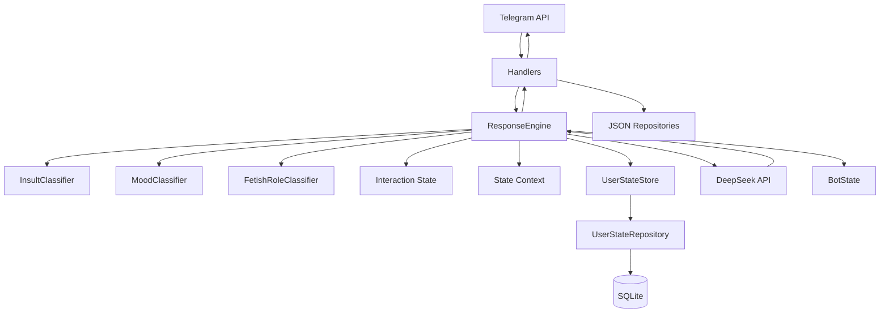

<div align="center">

# 🤖 Protogen Delta

### Асинхронный Telegram-бот на Python 3.14 с DeepSeek, RP-логикой, накопительными эмоциями и постоянным состоянием пользователей

<p>
  <a href="https://github.com/Exichek/Protogen-Delta/actions/workflows/tests.yml">
    
  </a>
  
  
  
  
  
  
  =95%">
  
</p>

**Python · aiogram · DeepSeek · SQLite · Poetry · Docker · pytest**

[О проекте](#-о-проекте) •
[Возможности](#-возможности) •
[Состояние и память](#-состояние-и-память) •
[Архитектура](#-архитектура) •
[Установка](#-установка) •
[Docker](#-docker) •
[Тестирование](#-тестирование)

</div>

---

## 📖 О проекте

**Protogen Delta** — Telegram-бот с собственной личностью, контекстными реакциями, RP-логикой, системой артов и интеграцией DeepSeek API.

Проект вырос из старой монолитной версии и сейчас построен как нормальное Python-приложение с разделением ответственности между Telegram-обработчиками, сервисами, состоянием, репозиториями и конфигурацией.

Главная цель проекта — не просто отправлять запросы в LLM, а постепенно собирать вокруг модели самостоятельную систему поведения:

- отдельная личность Дельты;
- контекстные реакции вместо пачки жёстко заданных ответов;
- раздельное состояние каждого пользователя;
- история текущего диалога;
- накопительные эмоции и отношения;
- постоянное хранение долгоживущего состояния в SQLite;
- RP-контекст и дополнительная классификация;
- безопасная сериализация запросов одного пользователя;
- тестируемая и заменяемая архитектура.

> [!NOTE]
> Личность, знания о теле и RP-модификатор вынесены в отдельные prompt-файлы.
> Статическая часть системного prompt загружается один раз при старте, а динамический контекст добавляется только когда он действительно нужен.

### Текущее состояние

| Метрика | Значение |
|---|---:|
| Python | **3.14** |
| Tests | **255 passed** |
| Coverage | **не ниже 95% в CI** |
| Source files under mypy | **35** |
| CI | **GitHub Actions** |
| Telegram framework | **aiogram 3** |
| AI | **DeepSeek API (`deepseek-flash` по умолчанию)** |
| Persistence | **SQLite + JSON runtime data** |
| Package manager | **Poetry 2.4.1** |
| Containerization | **Docker** |
| License | **MIT** |

Точный процент coverage специально не зафиксирован статическим числом в README: GitHub Actions проверяет актуальное покрытие на каждом PR и push и отклоняет сборку, если оно падает ниже **95%**.

---

## ⚙️ Возможности

### 💬 Диалоги и DeepSeek

Основные ответы генерируются через DeepSeek.

Поддерживается:

- обычный диалог;
- история последних сообщений пользователя;
- отдельное состояние каждого пользователя;
- контекстная классификация настроения;
- классификация оскорблений;
- RP-определение по действиям в `*звёздочках*`;
- определение направления RP-действия при fetish-контексте;
- динамическое формирование системного prompt;
- типизированная обработка ошибок DeepSeek API;
- отдельная обработка timeout, rate limit, connection и auth ошибок;
- разбиение слишком длинных Telegram-сообщений;
- пользовательский rate limit;
- последовательная обработка одновременных запросов одного пользователя.

Заготовленные сервисы для отдельных приветствий, оскорблений и автоматических эмоутов больше не управляют обычным диалогом. Контекст сообщения передаётся основной модели, чтобы реакция формировалась естественно с учётом личности Дельты и истории общения.

---

### 🧠 Личность и динамический контекст

Личность разделена на несколько независимых prompt-файлов:

```text
config/prompts/personality/
├── core.txt
├── protogen_lore.txt
├── body.txt
└── rp.txt
```

| Файл | Назначение |
|---|---|
| `core.txt` | характер, стиль общения, общие правила поведения |
| `protogen_lore.txt` | базовый лор вида Protogen |
| `body.txt` | описание тела и физических особенностей Дельты |
| `rp.txt` | дополнительный модификатор для RP |

Обычный системный prompt:

```text
core + protogen_lore + body
```

RP-prompt:

```text
core + protogen_lore + body + rp
```

Дополнительный динамический контекст добавляется только при необходимости: например, при выраженном настроении, конфликте, накопленной обиде, RP или других значимых состояниях.

---

### ❤️ Накопительные эмоции и отношения

Для каждого пользователя Дельта хранит две группы долгоживущего состояния.

**Эмоции:**

```text
warmth
irritation
playfulness
arousal
```

**Отношения:**

```text
familiarity
trust
affection
resentment
```

Все значения ограничены диапазоном `0.0 ... 1.0`.

Состояние меняется после взаимодействий:

- тёплые сообщения повышают `warmth`, `trust` и `affection`;
- игривые сообщения повышают `playfulness`;
- конфликт может увеличить `irritation` и `resentment`;
- прямое оскорбление влияет сильнее, чем конфликтный вопрос;
- агрессия в адрес третьего лица не считается нападением на Дельту;
- краткосрочные эмоции постепенно затухают между сообщениями;
- положительное взаимодействие может уменьшать накопленный негатив.

Модель **не получает сырые числа** вроде `resentment=0.37`.
`state_context.py` переводит значимое накопленное состояние в естественный текстовый контекст только после достижения нужных порогов.

> [!IMPORTANT]
> Накопленное возбуждение не прокидывается в обычный разговор само по себе.
> Интимный state-context добавляется только при уже установленном RP или текущем явно интимном сообщении.

---

### 💾 Постоянное состояние через SQLite

Долгоживущие эмоции и отношения сохраняются в:

```text
data/user_states.db
```

SQLite-репозиторий хранит состояние отдельно от runtime-контекста и использует UPSERT по Telegram `user_id`.

После перезапуска процесса восстанавливаются:

```text
warmth
irritation
playfulness
arousal
familiarity
trust
affection
resentment
```

Намеренно **не восстанавливаются**:

```text
mood
reply_count
history
asyncio.Lock
runtime timestamps
active operation counters
```

То есть после рестарта Дельта помнит сложившееся отношение к человеку, но не пытается притворяться, что незавершённая оперативная сессия продолжает существовать.

Хранилище подключено через абстракцию `UserStatePersistence`, поэтому `UserStateStore` не зависит напрямую от SQLite. В будущем SQLite-реализацию можно заменить, например, PostgreSQL-репозиторием без переписывания `ResponseEngine`.

---

### 🗨️ История диалога

Для каждого пользователя хранится ограниченная история завершённых ходов:

```text
user message
assistant reply
```

По умолчанию:

```env
CONVERSATION_HISTORY_LIMIT=8
```

История находится в памяти процесса и используется DeepSeek при следующем сообщении.

Команда:

```text
/reset
```

сбрасывает:

- текущий `mood`;
- `reply_count` пользователя;
- историю текущего разговора.

При этом `/reset` **не стирает накопленные эмоции и отношения** из SQLite.

---

### 👥 Изоляция пользователей и конкурентные запросы

`UserStateStore` создаёт отдельный `UserState` для каждого Telegram `user_id`.

У каждого состояния есть собственный `asyncio.Lock`, поэтому два одновременно пришедших сообщения одного пользователя обрабатываются последовательно. Это защищает историю, эмоциональное состояние, счётчики и сохранение persistence-state.

Состояния разных пользователей при этом не блокируют друг друга.

Неактивные runtime-состояния удаляются из памяти по retention timeout:

```env
USER_STATE_RETENTION_SECONDS=86400.0
```

После повторного обращения пользователя долгоживущее состояние заново загружается из SQLite.

---

### 🎭 RP-режим

RP-действия определяются по формату:

```text
*действие персонажа*
```

Для RP используется отдельный prompt-модификатор.

При наличии дополнительных тематических триггеров Дельта также может определить направление действия:

```text
active
passive
unknown
```

Упрощённый pipeline:

```text
Telegram message
      │
      ▼
Insult classifier
      │
      ▼
Mood classifier
      │
      ▼
Interaction state update
      │
      ├── emotions
      └── relationship
      │
      ▼
RP / triggers / role
      │
      ▼
Persistent state context
      │
      ▼
Dynamic system prompt
      │
      ▼
DeepSeek
      │
      ▼
Reply + history update
      │
      ▼
SQLite state save
```

---

### 🖼️ Система артов

Бот сохраняет Telegram `file_id` изображений из заданной группы и умеет выдавать случайный арт по команде:

```text
/randomart
```

Поддерживается:

- добавление фотографий;
- добавление изображений, отправленных как документ;
- приём артов только из настроенной Telegram-группы;
- защита от повторного добавления;
- случайная выдача;
- просмотр количества артов;
- просмотр последних артов администратором;
- удаление по Telegram `file_id`.

> [!IMPORTANT]
> Оригинальные изображения локально не скачиваются.
> В `images.json` сохраняются Telegram `file_id`.

---

### 👤 Регистрация пользователей

При первом `/start` Telegram ID пользователя добавляется в:

```text
data/users.json
```

Первый запуск получает отдельное приветствие.

Повторный `/start` выбирает случайную реплику из:

```text
config/data/start_messages.json
```

Этот набор используется как personality-flavor с реакциями в духе очередного запуска/«перезагрузки».

---

## 📋 Telegram-команды

### Пользовательские

```text
/start      Запустить бота / зарегистрироваться
/help       Показать справку
/randomart  Получить случайный арт
/reset      Очистить текущую память диалога
```

### Административные

```text
/listimages <N>          Показать последние N артов
/removeimage <id1,id2>   Удалить арты по Telegram file_id
/artcount                Показать количество сохранённых артов
/status                  Показать uptime, пользователей и число ответов процесса
/ping                    Проверить административный роутер
/ownhelp                 Показать список админских команд
```

---

## 🧩 Архитектура

Проект использует `src-layout`.



| Слой | Назначение |
|---|---|
| `handlers` | Telegram-команды и входящие события |
| `services` | DeepSeek, классификаторы, ResponseEngine и state-context |
| `repositories` | JSON- и SQLite-хранилища |
| `config` | env settings, статические JSON и prompts |
| `core` | runtime-state, rate limiting, logging, Telegram helpers |
| `main.py` | composition root |

---

## 📁 Структура проекта

```text
Protogen-Delta/
├── src/
│   └── protogen_delta/
│       ├── config/
│       │   ├── data/
│       │   │   ├── fetish_names.json
│       │   │   ├── fetishes_triggers.json
│       │   │   └── start_messages.json
│       │   ├── prompts/
│       │   │   ├── personality/
│       │   │   │   ├── body.txt
│       │   │   │   ├── core.txt
│       │   │   │   ├── protogen_lore.txt
│       │   │   │   └── rp.txt
│       │   │   ├── fetish_role_classification.txt
│       │   │   ├── insult_classification.txt
│       │   │   └── mood_classification.txt
│       │   ├── json_loader.py
│       │   ├── prompt_loader.py
│       │   └── settings.py
│       ├── core/
│       │   ├── logging_config.py
│       │   ├── message_utils.py
│       │   ├── rate_limiter.py
│       │   ├── state.py
│       │   ├── telegram_commands.py
│       │   └── user_state.py
│       ├── handlers/
│       │   ├── admin.py
│       │   ├── art.py
│       │   ├── errors.py
│       │   ├── help.py
│       │   ├── reset.py
│       │   ├── start.py
│       │   ├── text.py
│       │   └── unknown_command.py
│       ├── repositories/
│       │   ├── images.py
│       │   ├── json_file.py
│       │   ├── user_state.py
│       │   └── users.py
│       ├── services/
│       │   ├── deepseek.py
│       │   ├── fetishes.py
│       │   ├── insults.py
│       │   ├── interaction_state.py
│       │   ├── mood.py
│       │   ├── response_engine.py
│       │   └── state_context.py
│       └── main.py
├── tests/
├── data/
├── .env.example
├── .github/workflows/tests.yml
├── Dockerfile
├── pyproject.toml
├── poetry.lock
└── README.md
```

---

## 🛠️ Технологии

| Технология | Назначение |
|---|---|
| Python 3.14 | основной язык |
| aiogram 3 | Telegram Bot API |
| DeepSeek API | генерация и классификация текста |
| OpenAI Python SDK | API-клиент для DeepSeek-compatible endpoint |
| SQLite (`sqlite3`) | постоянное состояние эмоций и отношений |
| JSON | пользователи и Telegram `file_id` артов |
| Poetry | зависимости, окружение и сборка |
| python-dotenv | загрузка `.env` |
| pytest | тесты |
| pytest-cov | coverage |
| Black | форматирование |
| isort | сортировка импортов |
| Flake8 | linting |
| mypy | статическая типизация |
| GitHub Actions | CI |
| Docker | контейнеризация |

Для SQLite отдельная зависимость не нужна: используется стандартный модуль Python `sqlite3`.

---

# 📦 Установка

## Требования

```text
Python >=3.14,<3.15
Poetry
Git
```

## Клонирование

```bash
git clone git@github.com:Exichek/Protogen-Delta.git
cd Protogen-Delta
```

## Установка зависимостей

```bash
poetry install
```

---

# ⚙️ Настройка окружения

### Windows PowerShell

```powershell
Copy-Item .env.example .env
```

### Linux / macOS

```bash
cp .env.example .env
```

Актуальный шаблон:

```env
TELEGRAM_TOKEN=
DEEPSEEK_API_KEY=

DEEPSEEK_BASE_URL=https://api.deepseek.com
DEEPSEEK_MODEL=deepseek-flash

LOG_LEVEL=INFO
DATA_DIR=data

RATE_LIMIT_SECONDS=2.0
RATE_LIMIT_RETENTION_SECONDS=300.0

CONVERSATION_HISTORY_LIMIT=8
USER_STATE_RETENTION_SECONDS=86400.0

ADMIN_IDS=

ART_CHAT_ID=
```

| Переменная | Назначение |
|---|---|
| `TELEGRAM_TOKEN` | токен Telegram-бота |
| `DEEPSEEK_API_KEY` | API-ключ DeepSeek |
| `DEEPSEEK_BASE_URL` | API endpoint |
| `DEEPSEEK_MODEL` | имя модели |
| `LOG_LEVEL` | уровень логирования |
| `DATA_DIR` | runtime-каталог |
| `RATE_LIMIT_SECONDS` | cooldown между сообщениями пользователя |
| `RATE_LIMIT_RETENTION_SECONDS` | retention rate-limit записей |
| `CONVERSATION_HISTORY_LIMIT` | число ходов истории на пользователя |
| `USER_STATE_RETENTION_SECONDS` | retention runtime-state в RAM |
| `ADMIN_IDS` | Telegram ID администраторов через запятую |
| `ART_CHAT_ID` | ID группы для добавления артов |

> [!CAUTION]
> Не коммить настоящий `.env`.
> Если `TELEGRAM_TOKEN` или `DEEPSEEK_API_KEY` попали в публичную историю Git, их нужно перевыпустить.

---

# ▶️ Локальный запуск

```bash
poetry run python -m protogen_delta.main
```

Protogen Delta использует Telegram **long polling**, поэтому отдельный HTTP-порт не требуется.

При первом запуске автоматически создаётся:

```text
data/user_states.db
```

---

# 💾 Runtime data

При стандартном `DATA_DIR=data`:

```text
data/
├── users.json
├── images.json
└── user_states.db
```

| Файл | Содержимое |
|---|---|
| `users.json` | зарегистрированные Telegram user IDs |
| `images.json` | Telegram `file_id` артов |
| `user_states.db` | накопленные эмоции и отношения |

Каталог `data/` находится в `.gitignore`.

---

# 🐳 Docker

Проект собирается multi-stage Dockerfile.

```text
builder
├── Python 3.14
├── Poetry 2.4.1
└── wheel + /opt/venv

runtime
├── Python 3.14 slim
├── /opt/venv
├── /app/data
└── non-root user: protogen
```

## Сборка

```bash
docker build -t protogen-delta .
```

## Windows PowerShell

```powershell
docker run --rm `
  --name protogen-delta `
  --env-file .env `
  -v "${PWD}\data:/app/data" `
  protogen-delta
```

## Linux / macOS

```bash
docker run --rm \
  --name protogen-delta \
  --env-file .env \
  -v "$(pwd)/data:/app/data" \
  protogen-delta
```

Bind mount `data:/app/data` особенно важен для SQLite: без него база будет находиться внутри контейнера.

Логи:

```bash
docker logs -f protogen-delta
```

Остановка:

```bash
docker stop protogen-delta
```

> [!WARNING]
> Не запускай одновременно два экземпляра long-polling бота с одним Telegram Bot Token.

---

# 🧪 Тестирование

Текущее состояние:

```text
255 passed
35 source files проходят mypy
coverage gate в CI: >=95%
```

Проверяются:

- settings и env parsing;
- prompt- и JSON-loaders;
- DeepSeek service;
- classifiers;
- rate limiter;
- JSON repositories;
- SQLite persistence;
- восстановление state новым экземпляром repository/store;
- изоляция пользователей;
- concurrent locks;
- runtime retention;
- накопительные эмоции и отношения;
- decay краткосрочных эмоций;
- dynamic state-context;
- RP;
- conversation history;
- `/reset`;
- Telegram handlers;
- система артов;
- admin commands;
- `main.py`.

## Локальный полный QA

```bash
poetry run black --check src tests
poetry run isort --check-only src tests
poetry run flake8 src tests
poetry run mypy src
poetry run pytest
poetry build
```

Coverage:

```bash
poetry run pytest --cov=src/protogen_delta --cov-report=term-missing --cov-fail-under=95
```

---

# 🔄 CI

GitHub Actions запускается на `push` и pull request для `develop` и `main`.

Pipeline:

```text
checkout
  ↓
Python 3.14
  ↓
Poetry 2.4.1
  ↓
poetry check
  ↓
poetry install
  ↓
Black
  ↓
isort
  ↓
Flake8
  ↓
mypy
  ↓
pytest + coverage >=95%
  ↓
poetry build
```

---

# 🗃️ Persistence и дальнейший рост

Сейчас SQLite выбран намеренно: отдельный сервер базы проекту пока не нужен, а состояние уже должно переживать рестарты.

```text
ResponseEngine
      ↓
UserStateStore
      ↓
UserStatePersistence
      ↓
UserStateRepository
      ↓
SQLite
```

При росте проекта нижний слой можно заменить PostgreSQL-репозиторием без переноса persistence-логики в `ResponseEngine`.

---

# 🛣️ Ближайшие направления развития

То, чего в текущей версии **ещё нет**:

- proactive messages после длительного отсутствия пользователя;
- time-based развитие и затухание состояния;
- более долгосрочная память;
- persistent RP mode;
- сокращение лишних classifier-вызовов;
- при росте нагрузки — миграция persistence на PostgreSQL.

---

# 🔐 Безопасность и эксплуатация

- `.env` не хранится в Git;
- `data/` не хранится в Git;
- Docker runtime работает не от root;
- админские команды проверяют `ADMIN_IDS`;
- состояние пользователей изолировано по Telegram `user_id`;
- concurrent requests одного пользователя сериализуются.

---

# 📄 Лицензия

Проект распространяется по лицензии **MIT**.

---

<div align="center">

**Protogen Delta**

`develop` — актуальная ветка разработки  
`main` — основная стабильная ветка

</div>
