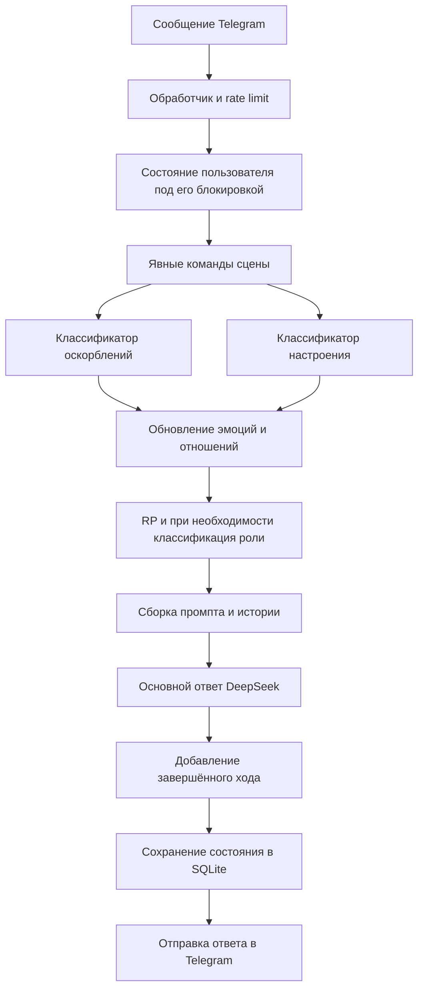

<div align="center">

# 🤖 Protogen Delta

### Асинхронный Telegram-бот с DeepSeek, собственной личностью, RP и сохраняемыми эмоциями и отношениями

[](https://github.com/Exichek/Protogen-Delta/actions/workflows/tests.yml)


[](LICENSE)

**Python · aiogram · DeepSeek · SQLite · Poetry · Docker · pytest**

[О проекте](#about) • [Возможности](#features) • [Память](#memory) • [RP](#roleplay) • [Команды](#commands) • [Архитектура](#architecture) • [Установка](#setup) • [Docker](#docker) • [Проверки](#testing)

</div>

<a id="about"></a>
## 📖 О проекте

**Protogen Delta** — Telegram-бот с персонажем Дельтой: собственной манерой речи, контекстными реакциями и отношением, которое меняется по мере общения с каждым пользователем.

DeepSeek генерирует ответы, а приложение управляет историей, классификацией сообщений, эмоциями, отношениями и состоянием сцены. Telegram-обработчики, сервисы и хранилища разделены, поэтому поведение можно проверять отдельно от сети и менять без переписывания всего бота.

`develop` — актуальная ветка разработки; `main` — стабильная ветка. Описание ниже относится к коду той ветки, в которой открыт README.

### Текущее состояние

| Компонент | Состояние |
|---|---|
| Python | `>=3.14,<3.15` |
| Telegram | aiogram 3, long polling, необязательный прокси |
| Генерация | DeepSeek API через OpenAI Python SDK; `deepseek-flash` по умолчанию |
| Состояние | SQLite для эмоций, отношений и RP; JSON для регистрации и артов |
| Зависимости | Poetry; зафиксированные версии в `poetry.lock` |
| CI | GitHub Actions: форматирование, линтинг, типизация, тесты и сборка |
| Coverage gate | Не ниже **95%** |
| Развёртывание | Локальный процесс или Docker |
| Лицензия | MIT |

Контрольный прогон **25.09.2026**, после PR #31: **326 тестов**, **96,80% покрытия**, **61 Python-файл** проверен mypy (`src` и `tests`), Python 3.14.7. Это снимок конкретной проверки; текущий результат смотрите в [GitHub Actions](https://github.com/Exichek/Protogen-Delta/actions/workflows/tests.yml).

<a id="features"></a>
## ⚙️ Возможности

- Диалог с историей последних завершённых ходов и отдельным состоянием каждого пользователя.
- Параллельная классификация настроения и оскорблений перед основным ответом.
- Накопительные эмоции и отношения; затухание краткосрочных эмоций по прошедшему времени.
- Сохраняемый RP-режим, конфигурация Дельты и явно заданное описание персонажа пользователя.
- Выход из RP отдельной командой или в одном сообщении с новым вопросом.
- Первый `/start`: представление с фиксированным именем, продолжение через DeepSeek и резервный ответ при сбое. Повторный `/start`: случайная реплика из конфигурации.
- Полный сброс памяти по подтверждению пользователя.
- Случайные арты из настроенной Telegram-группы и административные команды управления ими.
- Ограничение частоты сообщений, разбиение длинных ответов, обработка ошибок API.
- Метрики запросов DeepSeek и связанные логи по `user_id` и `request_id`.

### Личность и контекст

| Файл в `src/protogen_delta/config/prompts/` | Назначение |
|---|---|
| `personality/core.txt` | Характер, инициатива, стиль речи, ограничения памяти и обоснованность выводов |
| `personality/protogen_lore.txt` | Лор вида |
| `personality/body.txt` | Особенности Дельты |
| `personality/rp.txt` | Правила ролевого взаимодействия |
| `start_greeting.txt` | Продолжение первого приветствия |
| `*_classification.txt` | Инструкции классификаторам |

Статические промпты загружаются один раз при запуске. Обычный ответ использует `core + protogen_lore + body`, RP добавляет `rp`. На каждом ходе приложение передаёт текущий режим; значимые эмоции и отношения преобразуются в текстовый контекст по порогам. Численные показатели отношений напрямую модели не передаются.

<a id="memory"></a>
## 🧠 Состояние и память

| Данные | Где хранятся | После рестарта |
|---|---|---|
| Последние завершённые ходы `user → assistant` | Память процесса; по умолчанию 8 ходов | Не восстанавливаются |
| `mood`, счётчик ответов пользователя, блокировки | Память процесса | Сбрасываются |
| Эмоции: `warmth`, `irritation`, `playfulness`, `arousal` | SQLite | Восстанавливаются с учётом затухания |
| Отношения: `familiarity`, `trust`, `affection`, `resentment` | SQLite | Восстанавливаются |
| Время последнего обновления эмоций | SQLite | Используется для расчёта затухания |
| RP: активность, конфигурация Дельты, описание персонажа пользователя | SQLite | Восстанавливаются |
| Зарегистрированные Telegram ID | `users.json` | Сохраняются |
| Telegram `file_id` артов | `images.json` | Сохраняются |

Эмоции и отношения ограничены диапазоном `0.0 … 1.0`. Тёплое общение повышает доверие и привязанность, конфликт может накапливать раздражение и обиду. Эмоции ослабевают при следующем обращении к состоянию, пропорционально прошедшему времени; отдельного фонового таймера нет. Отношения автоматически по времени не затухают.

**Отношение не заменяет память фактов.** После рестарта Дельта может сохранять доверие или обиду, но точный текст прежних разговоров ему недоступен. Сохранившийся RP-режим тоже не восстанавливает события сцены.

### Сброс и выход из сцены

| Действие | Результат |
|---|---|
| `/rp off` или отдельное `стоп RP` | Выключает RP, очищает конфигурацию сцены и описание персонажа; сохраняет историю, эмоции и отношения |
| `Стоп RP, что такое TCP?` | Выполняет выход из RP и отвечает на оставшийся вопрос в обычном режиме |
| `/reset` → подтверждение | Сбрасывает историю, настроение, счётчик, эмоции, отношения и RP; удаляет сохранённое состояние и регистрацию пользователя |
| Повторный `/start` | Отвечает стартовой репликой; сам по себе память не сбрасывает |

Подтверждение `/reset` проверяет владельца кнопки и срок её действия; сброс можно отменить. После полного сброса следующий `/start` снова считается первым.

### Изоляция и хранение

Каждый Telegram `user_id` имеет собственный `asyncio.Lock`. Операции с его состоянием выполняются последовательно; разные пользователи не делят эту блокировку. Неактивное состояние удаляется из RAM по `USER_STATE_RETENTION_SECONDS`, затем при необходимости восстанавливается из SQLite. SQLite-операции чтения и записи выполняются вне event loop; изменения схемы добавляются совместимыми миграциями.

Обычный текстовый ответ удерживает блокировку до окончания отправки всех частей в Telegram. Повторное обычное сообщение во время обработки получает уведомление об ожидании (или cooldown), а не ставится в очередь генерации. `/reset` и выключение RP дожидаются текущей отправки; подтверждение сброса приходит после неё.

История и счётчики ответов обновляются только после успешной отправки всех частей. Если отправка прервалась, полный ответ не записывается; уже отправленные части могут остаться в чате. Эмоциональная реакция на входящее сообщение сохраняется. При сетевом таймауте неизвестно, принял ли Telegram последнюю часть; автоматической повторной отправки здесь нет. Логи отправки содержат результат, число частей и длительность, без текста сообщения, с контекстом запроса генерации. Эти гарантии относятся к обычному текстовому маршруту в одном процессе; прямой `ResponseEngine.respond()` для API-проверок сохраняет завершённый ход при возврате результата.

При стандартном `DATA_DIR=data` рабочие файлы находятся здесь:

```text
data/
├── users.json
├── images.json
└── user_states.db
```

<a id="roleplay"></a>
## 🎭 RP-режим

Действие в `*звёздочках*` включает RP. Следующие сообщения продолжают сцену без обязательных звёздочек. При тематических триггерах внутри RP дополнительно определяется направление действия (`active`, `passive`, `unknown`).

Одиночные звёздочки с текстом распознаются как действие; код в обратных кавычках, двойные звёздочки и простые выражения вроде `2 * 3 * 4` сцену не включают. Это эвристика: обычный курсив с текстом может выглядеть как действие. Стоп-фразы принимают финальную пунктуацию, включая `?` и `…`.

Конфигурацию можно задать явно:

```text
Ты в женской конфигурации.
Ты в мужской конфигурации.
Давай в этой сцене ты в женской конфигурации. *подхожу и машу рукой*
```

Эти фразы включают RP и обновляют сохраняемое поле. Конфигурация переживает выход исходной просьбы за окно истории и рестарт процесса. Завершение сцены возвращает базовую мужскую конфигурацию.

Описание собственного персонажа задаётся отдельным сообщением:

```text
Мой персонаж: человек в пальто
```

Поддерживается одна строка до 500 символов. Описание передаётся как данные сцены. Неуказанные вид, пол и анатомию бот не должен заимствовать из описания Дельты или додумывать самостоятельно.

> [!NOTE]
> Сохраняемые поля меняются по явно поддерживаемым формулировкам. Произвольная перефразировка может быть понята моделью в текущем диалоге, но не обязательно обновит состояние приложения. Правила промпта задают желаемое поведение и не гарантируют каждую реплику модели.

Для выхода доступны `/rp off`, `стоп RP`, `хватит RP`, `выйди из RP`, `закончим RP`, `закончи RP` — также с кириллическим `рп`. Фраза остановки должна находиться в начале сообщения; после неё можно добавить вопрос.

<a id="commands"></a>
## 📋 Telegram-команды

| Команда | Действие |
|---|---|
| `/start` | Регистрация и приветствие либо повторная стартовая реплика |
| `/help` | Справка |
| `/randomart` | Случайный арт |
| `/rp off` | Завершение RP без полного сброса памяти |
| `/reset` | Запрос подтверждения полного сброса памяти о пользователе |

Административные команды доступны ID из `ADMIN_IDS`:

| Команда | Действие |
|---|---|
| `/listimages <N>` | Последние N артов |
| `/removeimage <id1,id2>` | Удаление по Telegram `file_id` |
| `/artcount` | Количество артов |
| `/status` | Uptime, количество пользователей и ответов процесса |
| `/ping` | Проверка административного роутера |
| `/ownhelp` | Справка администратора |

Фотографии и изображения-документы принимаются из группы `ART_CHAT_ID`, дубликаты отбрасываются. Локально сохраняются только Telegram `file_id`; оригинальные изображения не скачиваются.

<a id="architecture"></a>
## 🧩 Архитектура



Схема показывает успешную обработку текстового сообщения. Два основных классификатора выполняются параллельно через `asyncio.gather`; основной ответ ждёт их завершения. Отдельная команда выхода из RP не требует вызова модели.

| Каталог | Ответственность |
|---|---|
| `src/protogen_delta/handlers/` | Telegram-команды и события |
| `src/protogen_delta/services/` | DeepSeek, классификаторы, движок ответов, контекст состояния |
| `src/protogen_delta/core/` | Состояние, команды сцены, rate limit, контекст логов |
| `src/protogen_delta/repositories/` | SQLite и JSON |
| `src/protogen_delta/config/` | Настройки, промпты, статические JSON |
| `src/protogen_delta/main.py` | Создание зависимостей и запуск polling |
| `tests/` | Автоматические проверки |
| `scripts/evaluate_dialogue.py` | Ручная проверка реальных ответов модели |
| `.github/workflows/tests.yml` | CI |

### Диагностика

Для DeepSeek логируются длительность запроса, token usage, cache hit/miss, размер системного промпта, число ходов истории и длина сообщения. Эти метрики не включают текст промпта или сообщения.

Внутри одного `ResponseEngine.respond()` общий `request_id` и `user_id` связывают классификаторы, HTTP-вызовы и основной запрос. Контекст восстанавливается при выходе и не переносится в следующий запрос. Метрики позволяют сравнивать задержки; фиксированного обещания времени ответа нет.

<a id="setup"></a>
## 📦 Установка и запуск

Нужны **Python 3.14**, Git и Poetry. В CI и Docker используется **Poetry 2.4.1**.

```bash
git clone https://github.com/Exichek/Protogen-Delta.git
cd Protogen-Delta
git switch develop
poetry install
```

Создайте `.env` из шаблона:

```powershell
# Windows PowerShell
Copy-Item .env.example .env
```

```bash
# Linux / macOS
cp .env.example .env
```

Заполните обязательные `TELEGRAM_TOKEN`, `DEEPSEEK_API_KEY` и `ART_CHAT_ID`. Полный шаблон — в [.env.example](.env.example).

| Переменная | По умолчанию / назначение |
|---|---|
| `TELEGRAM_TOKEN` | Обязательный токен бота |
| `DEEPSEEK_API_KEY` | Обязательный API-ключ |
| `ART_CHAT_ID` | Обязательный целочисленный ID группы артов |
| `DEEPSEEK_BASE_URL` | `https://api.deepseek.com` |
| `DEEPSEEK_MODEL` | `deepseek-flash` |
| `TELEGRAM_PROXY_URL` | Пусто — прямое соединение; иначе прокси для Telegram |
| `LOG_LEVEL` | `INFO` |
| `DATA_DIR` | `data` |
| `ADMIN_IDS` | Пусто; Telegram ID администраторов через запятую |
| `RATE_LIMIT_SECONDS` | `2.0`; пауза между обычными сообщениями пользователя |
| `RATE_LIMIT_RETENTION_SECONDS` | `300.0`; срок хранения записей rate limiter |
| `CONVERSATION_HISTORY_LIMIT` | `8`; число завершённых ходов на пользователя |
| `USER_STATE_RETENTION_SECONDS` | `86400.0`; срок хранения неактивного состояния в RAM |

`TELEGRAM_PROXY_URL` влияет на Telegram-сессию, а не на DeepSeek. Секреты и рабочие данные исключены из Git.

```bash
poetry run python -m protogen_delta.main
```

Бот использует long polling, отдельный HTTP-порт не нужен. Рабочие хранилища создаются автоматически. Не запускайте два polling-процесса с одним токеном одновременно.

<a id="docker"></a>
## 🐳 Docker

Multi-stage Dockerfile собирает wheel и окружение, затем запускает приложение от пользователя `protogen` в `python:3.14-slim`.

```bash
docker build -t protogen-delta .
```

Windows PowerShell:

```powershell
docker run --rm --name protogen-delta --env-file .env -e DATA_DIR=/app/data -v "${PWD}\data:/app/data" protogen-delta
```

Linux / macOS:

```bash
docker run --rm --name protogen-delta --env-file .env -e DATA_DIR=/app/data -v "$(pwd)/data:/app/data" protogen-delta
```

Каталог на хосте должен быть доступен для записи пользователю контейнера. Том сохраняет SQLite и JSON между пересозданиями контейнера.

```bash
docker logs -f protogen-delta
docker stop protogen-delta
```

<a id="testing"></a>
## 🧪 Проверки

### Автоматические тесты и CI

```bash
poetry check
poetry run black --check src tests
poetry run isort --check-only src tests
poetry run flake8 src tests
poetry run mypy src tests
poetry run pytest --cov=src/protogen_delta --cov-report=term-missing --cov-fail-under=95
poetry build
```

GitHub Actions выполняет эти проверки на push в `develop`/`main` и PR в эти ветки. Тесты охватывают API-ошибки, изоляцию истории, блокировки, параллельный запуск классификаторов, сохранение и миграции SQLite, затухание эмоций, сброс с подтверждением, команды, переходы RP и корреляцию логов. Внешние API в unit-тестах заменяются тестовыми объектами.

### Реальные ответы DeepSeek

Из корня клонированного репозитория:

```bash
poetry run python scripts/evaluate_dialogue.py --env-file .env --output data/dialogue-check.json
```

Ручной запуск делает **13 основных запросов и дополнительные вызовы классификаторов**, расходуя API. Он создаёт отдельные состояния в памяти, не запускает Telegram polling и не открывает рабочую базу пользователей. Ключ в JSON-отчёт не записывается.

Сценарии: инициатива в разговоре, анатомия пользователя, женский род после очистки истории, смешанный выход из RP, разбор логов, три пары «доверие / обида» с одинаковым вопросом и пустой историей.

Ответы сохраняются для ручной оценки. Этот прогон не выставляет автоматическую оценку качества и не заменяет проверку через Telegram. Тест, подтверждающий наличие правила в промпте, не доказывает, что модель всегда его выполнит.

## 🛣️ Направления развития

- Долговременная память конкретных фактов и событий помимо отношений и описания персонажа.
- Проактивные сообщения и фоновое развитие состояния.
- Более гибкое распознавание команд сцены с проверкой корректности изменений.
- Сокращение лишних вызовов классификаторов с измерением качества и задержки.
- Расширение повторяемых сценариев оценки поведения модели.
- При росте нагрузки — другое хранилище за интерфейсом `UserStatePersistence`, например PostgreSQL.

Сохраняемый RP, затухание эмоций по времени, метрики API и корреляция логов уже реализованы.

## 📄 Лицензия

[MIT](LICENSE).
