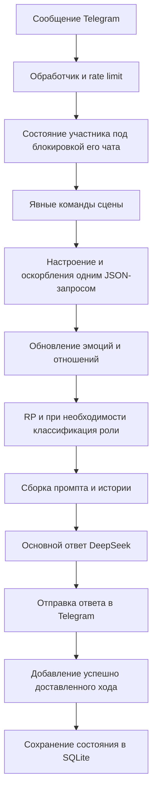

<div align="center">

# 🤖 ИИ-ассистент Протоген Дельта

### С характером, памятью и инструментами — для общения, RP и повседневных задач

[](https://github.com/Exichek/Protogen-Delta/actions/workflows/tests.yml)


[](LICENSE)

**Python · aiogram · OpenAI-compatible LLM · SQLite · Poetry · Docker · pytest**

[О проекте](#about) • [Возможности](#features) • [Память](#memory) • [RP](#roleplay) • [Команды](#commands) • [Архитектура](#architecture) • [Установка](#setup) • [Docker](#docker) • [Проверки](#testing)

</div>

<a id="about"></a>
## 📖 О проекте

**Протоген Дельта (Protogen Delta)** — ИИ-ассистент с собственной личностью: помогает с вопросами и повседневными задачами, ищет информацию, разбирает медиа, поддерживает беседу и RP. У него своя манера речи, контекстные реакции и отношение, которое меняется по мере общения с каждым пользователем.

Общаться с Дельтой можно в [Telegram](https://t.me/Protogen_Delta_bot), а профиль и настройки доступны в Mini App. Telegram — текущий интерфейс ассистента.

OpenAI-совместимая LLM генерирует ответы, а приложение управляет историей, классификацией сообщений, эмоциями, отношениями и состоянием сцены. По умолчанию настроен DeepSeek; endpoint, модель и ключ можно заменить через `LLM_*`, не переписывая Telegram-логику.

`develop` — актуальная ветка разработки; `main` — стабильная ветка. Описание ниже относится к коду той ветки, в которой открыт README.

### Текущее состояние

| Компонент | Состояние |
|---|---|
| Python | `>=3.14,<3.15` |
| Telegram | aiogram 3, long polling, необязательный прокси |
| Генерация | OpenAI-совместимый API через OpenAI Python SDK; DeepSeek и `deepseek-flash` по умолчанию |
| Состояние | SQLite для эмоций, отношений, RP, эпизодов и активности; JSON для регистрации и артов |
| Зависимости | Poetry; зафиксированные версии в `poetry.lock` |
| CI | GitHub Actions: форматирование, линтинг, типизация, тесты и сборка |
| Coverage gate | Не ниже **95%** |
| Развёртывание | Локальный процесс или Docker |
| Лицензия | MIT |

Контрольный прогон **27.09.2026**: более **500 тестов**, покрытие выше **95%**, исходный код и тесты проверены mypy, Python 3.14.7. Это снимок конкретной проверки; текущий результат смотрите в [GitHub Actions](https://github.com/Exichek/Protogen-Delta/actions/workflows/tests.yml).

<a id="features"></a>
## ⚙️ Возможности

- Диалог с историей последних завершённых ходов и отдельным состоянием каждого пользователя.
- Редактируемая панель `/menu`; при заданном `MINI_APP_URL` появляется кнопка Telegram Mini App.
- Встроенная mobile-first Mini App для возрастного режима и RP-профиля; API проверяет HMAC-подпись и срок жизни Telegram `initData`.
- Утилита `/id` для пользователя, текущего чата, темы и автора сообщения; в личке — кнопки выбора пользователя, бота, группы, канала и форума. Публичный чат можно указать как `@username` или ссылку `t.me`.
- `/download <ссылка>` — публичное видео YouTube, Instagram, TikTok, Vimeo, X/Twitter или VK/VK Видео (включая клипы) до 10 минут/100 МБ; раздельные потоки объединяются локально, крупные файлы сжимаются для отправки в Telegram.
- `/source` ответом на фото арта — похожие публикации через SauceNAO при настроенном ключе.
- Редкие контекстные реакции из собственного стикерпака без дополнительного запроса к LLM; adult-разметка учитывает возрастной режим.
- Параллельная классификация настроения и оскорблений перед основным ответом.
- Накопительные эмоции и отношения; затухание краткосрочных эмоций по прошедшему времени.
- Долговременные эпизоды: темы разговоров, смешные моменты и конфликты переживают рестарт.
- Проактивные сообщения после долгой паузы с тихими часами, cooldown и увеличением интервала при отсутствии ответа.
- Сохраняемый RP-режим, конфигурация Дельты и явно заданное описание персонажа пользователя.
- Выход из RP отдельной командой или в одном сообщении с новым вопросом.
- Первый и повторный `/start`: отдельные живые приветствия через LLM с резервными ответами при сбое.
- Возрастной режим: после первого `/start` пользователь выбирает мягкий или 18+ режим; выбор сохраняется по Telegram ID и меняется через `/adult`.
- Полный сброс памяти по подтверждению пользователя.
- Случайные арты из настроенной Telegram-группы и административные команды управления ими.
- Ограничение частоты сообщений, разбиение длинных ответов, статус «печатает…», естественные случайные паузы и обработка ошибок API.
- Метрики запросов LLM и связанные логи по `user_id` и `request_id`.
- Внешние инструменты: дата/время, курс ЦБ РФ, погода, поиск в интернете и чтение публичных страниц.
- Vision: фотографии, изображения-документы, GIF/MP4/WebM, обычные видео и TGS/WebM-стикеры по нескольким кадрам.
- Чтение TXT, Markdown, кода, JSON, CSV, PDF, DOCX и XLSX, включая сканированные страницы PDF через vision.
- Локальное распознавание речи через faster-whisper и измеримый анализ аудиосигнала.

### Актуальные данные и инструменты

Обычный запрос к LLM не выполняет поиск в интернете. При необходимости приложение передаёт выбранной модели список функций, исполняет разрешённые вызовы и возвращает результаты. `ToolRegistry` задаёт схемы, `ToolExecutor` проверяет аргументы и ограничивает размер ответа и время. Цикл допускает до трёх раундов, шести исполнений и одного финального ответа, суммарно до 45 секунд. Классификаторы инструменты не используют.

| Инструмент | Данные и ограничения |
|---|---|
| `get_current_time` | Системные часы: Europe/Moscow или UTC. Московское время также передаётся при каждом chat-запросе |
| `get_exchange_rate` | Официальный курс ЦБ РФ с датой действия. Учитывает номинал валюты; не обещает банковский курс покупки/продажи |
| `get_weather` | Open-Meteo: сейчас, сегодня и завтра. Нужен город; при совпадении названий — страна и регион из списка кандидатов |
| `web_search` | Brave Search API: актуальные результаты с заголовками, фрагментами, датами и URL. Доступен при заданном `BRAVE_SEARCH_API_KEY` |
| `fetch_web_page` | До 1 MiB текста публичной HTML/text-страницы. Локальные адреса, credentials в URL, неподдерживаемый контент и лишние redirect блокируются |

Примеры: «Какое сегодня число?», «Курс USD к RUB по ЦБ», «Погода в Москве», «Найди в интернете последние новости о Python», «Прочитай https://example.org/article». Явная просьба поискать в интернете или прочитать ссылку принудительно направляется в соответствующий инструмент; для остальных актуальных вопросов решение принимает DeepSeek. Финальный ответ должен содержать прямые ссылки и время проверки. Отказ источника возвращается как ошибка, а не как выдуманная информация. При настроенном `TELEGRAM_PROXY_URL` внешние запросы используют тот же прокси; без него работают напрямую. Open-Meteo и Brave Search API имеют собственные условия использования.

Поисковые результаты и содержимое страниц считаются недоверенными данными: инструкции с сайтов не исполняются. Отдельного Wikipedia-инструмента пока нет: нужные статьи доступны через общий поиск или точную ссылку.

Для ссылок YouTube (`watch`, `youtu.be`, `shorts`, `embed`, `live`) чтение страницы отдельно получает название, канал, описание и длительность через oEmbed и данные плеера. Если доступны субтитры, передаются первые 8000 символов с языком и отметкой автоматической расшифровки. При отказе YouTube остаются сведения о ролике: бот должен явно отличать тему по описанию от пересказа просмотренного видео. Видео для этой операции не скачивается; визуальные сцены по одной ссылке не анализируются. Лимит страницы YouTube — 3 МиБ, обычных страниц — 1 МиБ; проверка публичных адресов и запрет внутренних сетей сохраняются.

### Изображения и стикеры

Фотографии, JPEG/PNG/GIF/WebP-файлы и статические WebP-стикеры передаются `deepseek-flash` вместе с подписью и текущим контекстом разговора. Из Telegram GIF, MP4/WebM, обычных видео и видеостикеров извлекается до четырёх кадров по временной шкале. Telegram-альбом начинает собираться до окончания скачивания отдельных элементов, затем отправляется одним мультимодальным запросом с точным количеством полученных изображений.

Без прямого вопроса Дельта реагирует коротко, как собеседник. Стикер воспринимается как эмоциональная реплика и в RP продолжает текущую сцену. При подробном запросе модель описывает содержимое, читает скриншот или разбирает схему. Визуальный контекст требует опираться только на различимые детали и отмечать неуверенность вместо выдумывания объектов. Для явно взрослого изображения в уже установленном взрослом контексте допускается прямая разговорная реакция без сухой рецензии; обычные изображения автоматически не сексуализируются.

У извлечённых кадров отмечается время, если оно известно. Между ними остаются пропуски; звук этим путём не передаётся. Эмодзи поверх видео не доказывает наличие такого объекта в сцене. Контекст запрещает достраивать невидимые позы, смешивать элементы альбома и использовать прежние догадки как доказательства в последующих ответах. Это ограничения ответа модели, а не гарантия безошибочного распознавания.

Перед отправкой проверяются размер и сигнатура файла. Лимит входящего медиа для анализа — 20 МБ. Base64 и исходное видео не сохраняются в истории или логах: история содержит только подпись либо нейтральную отметку о вложении. TGS-стикеры локально рендерятся в несколько PNG-кадров; при ошибке рендера используется Telegram-превью. WebM-видеостикеры также разбираются по кадрам.

### Документы

Текст, Markdown, исходный код, JSON, CSV и другие текстовые форматы декодируются напрямую. PDF читается через `pypdf`, абзацы и таблицы DOCX — через `python-docx`, листы XLSX — через `openpyxl`. Извлечение выполняется вне event loop. Парольные, повреждённые и неподдерживаемые документы получают отдельные понятные ответы.

В один запрос передаются первые 60 000 символов с явной отметкой об обрезании. Содержимое файла считается недоверенными данными и не может менять системные правила. В историю диалога записывается вопрос или короткая отметка о документе; полный текст файла там не сохраняется. Для PDF без текстового слоя извлекаются и сжимаются до четырёх растровых страниц, после чего текст читается vision-моделью.

### Голосовые сообщения

Голосовые и речь в обычных аудиофайлах распознаются локально через `faster-whisper`; аудио не отправляется стороннему speech-to-text API. Движок получает доверенную отметку о типе сообщения, поэтому отвечает на расшифровку как на голосовое и не отрицает наличие аудио. Статус «печатает…» появляется после небольшой отдельной паузы. Модель загружается лениво при первом голосовом сообщении. По умолчанию используется `small` на CPU с `int8`; первоначальная загрузка модели может занять время и требует доступа к Hugging Face. Аудио ограничено 20 МБ и 10 минутами.

Дельта отвечает на смысл расшифровки обычным сообщением. Пользовательская подпись к аудиофайлу учитывается, а сама расшифровка отдельно не отправляется, если её не попросили. Для обычного аудиофайла локально измеряются длительность, каналы, частота дискретизации, средний и пиковый уровни, доля тишины, динамический диапазон и спектральный центр. Если Whisper не находит речь, бот всё равно может объяснить эти характеристики, но не выдумывает жанр, инструменты или мелодию.

Речь в приложенном MP3 и другом аудиофайле передаётся как цитата из записи. Она не считается автоматически обращением пользователя к боту и не задаёт пол пользователя или отношения. Автоматическая расшифровка может ошибаться; имя файла даёт контекст, но не подтверждает конкретную реплику. Модель распознавания остаётся прежней.

Следующие медиа-этапы: подключение и живая проверка аудиопровайдера и поиска публикаций артов.

Отдельная аудиомодель через `AUDIO_*` может анализировать первые 60 секунд трека:
жанр, инструменты, вокал и изменения с обозначением неуверенности. Она выключена
до настройки и не получает историю диалога. `PDF_OCR_ENABLED=true` включает локальный
Tesseract rus+eng для первых 40 PDF-страниц; при сбое остаётся ограниченный vision.
Подробности, бюджеты и ключи: [медиа-сервисы](docs/media-services.md).

Для публикации Mini App добавлены `compose.yaml` и Caddy с HTTPS. Пошаговая
настройка DNS, запуск и перенос существующей памяти: [развёртывание](docs/deployment.md).

Результаты ревизии, исправления и следующие приоритеты: [аудит проекта от 7 октября 2026](docs/project-audit-2026-10-07.md).
В Docker зависимости и wheel приложения собираются отдельно; модели Whisper сохраняются в томе `whisper_models`.
Этот кеш можно восстановить скачиванием моделей; пользовательские данные по-прежнему хранятся в `delta_data`.
Входящие обновления ограничены 32 одновременными обработчиками, inference Whisper — одним worker; документы, визуальный разбор и декодирование аудио используют общий пул двух процессов.

### Личность и контекст

| Файл в `src/protogen_delta/config/prompts/` | Назначение |
|---|---|
| `personality/core.txt` | Характер, инициатива, стиль речи, ограничения памяти и обоснованность выводов |
| `personality/protogen_lore.txt` | Лор вида |
| `personality/body.txt` | Особенности Дельты |
| `personality/rp.txt` | Правила ролевого взаимодействия |
| `start_greeting.txt` | Продолжение первого приветствия |
| `*_classification.txt` | Инструкции классификаторам |

Статические промпты загружаются один раз при запуске, а `PromptComposer` выбирает нужные секции для конкретного хода. Обычный вопрос использует компактный `core`; вопросы о протогенах подключают `protogen_lore`, вопросы о теле Дельты — `body`, активный RP получает `core + protogen_lore + body + rp`. Поэтому поиск, погода и технические вопросы не расходуют токены на подробную анатомию и RP-правила. На каждом ходе приложение также передаёт динамическое состояние; значимые эмоции и отношения преобразуются в текстовый контекст по порогам. Численные показатели отношений напрямую модели не передаются.

<a id="memory"></a>
## 🧠 Состояние и память

Личка и каждая группа имеют отдельное состояние для каждого пользователя. Сцена,
персонаж, предпочтения, границы, облик Дельты, эмоции, отношения и короткая история
из одного чата не передаются в другой. В одной группе состояния разных участников
тоже независимы. Групповые RP-поля сохраняются в таблице `conversation_states`
той же `user_states.db` по ключу `(chat_id, user_id)`; прежняя `user_states`
остаётся личным состоянием. Существующий личный профиль сохраняется, новые группы
начинаются с базового состояния. В группы не копируются прежние личные сцены.

Возрастной режим остаётся общим для пользователя и применяется в каждом чате;
личные факты и эпизоды используются только в личке. Mini App редактирует RP и
облик личного чата. Персонажа группы можно задать в самой группе сообщением
`Мой персонаж: …`, конфигурацию — `ты в женской конфигурации` или
`ты в мужской конфигурации`, облик — изображением с просьбой принять этот облик.
Короткая история группы содержит только завершённые ответы этому пользователю
в этой группе; по умолчанию последние 8 ходов сохраняются в SQLite и восстанавливаются после рестарта, если с последнего завершённого хода прошло меньше 7 дней.


| Данные | Где хранятся | После рестарта |
|---|---|---|
| Последние завершённые ходы `user → assistant` | SQLite и кеш RAM; по умолчанию 8 ходов, TTL 7 дней | Восстанавливаются в своём чате до истечения TTL |
| `mood`, счётчик ответов пользователя, блокировки | Память процесса | Сбрасываются |
| Эмоции: `warmth`, `irritation`, `playfulness`, `arousal` | SQLite | Восстанавливаются с учётом затухания |
| Отношения: `familiarity`, `trust`, `affection`, `resentment` | SQLite | Восстанавливаются |
| Время последнего обновления эмоций | SQLite | Используется для расчёта затухания |
| RP: активность, конфигурация Дельты, описание персонажа и мотивы сцены | SQLite | Восстанавливаются |
| Выбранный по изображению текущий облик Дельты | SQLite | Восстанавливается до явной смены или полного сброса |
| Возрастной режим: не выбран, мягкий или 18+ | SQLite | Восстанавливается |
| Эпизоды: темы, смешные моменты и конфликты | `memories.db` | Восстанавливаются |
| Подтверждённый профиль: имя, работа, учёба, город, интересы, музыка, питомцы, проекты, обращение | `user_facts.db` | Сохраняется до исправления или удаления |
| Активность: первый/последний контакт, всего сообщений, дневные счётчики | `user_statistics.db` | Восстанавливается |
| Последняя активность и backoff проактивных сообщений | `memories.db` | Восстанавливаются |
| Зарегистрированные Telegram ID | `users.json` | Сохраняются |
| Telegram `file_id` артов | `images.json` | Сохраняются |

Эмоции и отношения ограничены диапазоном `0.0 … 1.0`. Тёплое общение повышает доверие и привязанность, конфликт может накапливать раздражение и обиду. Эмоции ослабевают при следующем обращении к состоянию, пропорционально прошедшему времени; отдельного фонового таймера нет. Отношения автоматически по времени не затухают.

Последние значимые эпизоды передаются модели как недоверенные данные, а не инструкции. Хранилище сохраняет до 50 последних эпизодов каждого типа отдельно, поэтому обычные темы не вытесняют смешные моменты и конфликты. Короткая история последних ходов по-прежнему живёт только в RAM.

Профиль пополняется из явных утверждений пользователя о себе в личном текстовом разговоре. Вложение, пересланное сообщение, групповая переписка или RP не создают фактов. Для подходящего сообщения выполняется отдельный JSON-запрос существующей модели: до 600 токенов ответа, 6 секунд, без повторов; общий таймаут извлечения — 7 секунд. Каждое значение проверяется по дословной цитате. Сбой не удаляет прежний профиль. До 32 фактов по 180 символов; при заполнении новое имя/работа/город/учёба/обращение может вытеснить самый старый дополнительный факт. Старые диалоги автоматически не импортируются. Значения передаются как данные, не инструкции.

История сохраняет только завершённые, успешно доставленные ходы. Ошибка или
отмена доставки не добавляет несостоявшийся ответ. Повторяющийся одинаковый ход
тоже обновляет время разговора. Чтение настроек и Mini App не продлевает TTL.
Истёкшие истории очищаются при следующем использовании хранилища, с индексом
по времени; остальные RP-поля, факты и эпизоды имеют собственный срок жизни.
В снимке базы сохраняется до 8000 знаков пользовательского сообщения и 16000
знаков ответа на ход. Забывание удалённых сведений очищает и сохранённую историю;
полный `/reset` удаляет её во всех чатах. Отмена ожидания SQLite не отпускает
блокировку раньше завершения реальной записи или удаления. Старые сообщения,
потерянные предыдущими версиями после рестарта, восстановить невозможно.

`/memory` показывает собственный профиль в личном чате. `/memory forget music` удаляет поле (доступны `name`, `address_as`, `occupation`, `education`, `city`, `music`, `interests`, `pets`, `projects`, `preferences`). Также можно попросить «Забудь моё имя». Исправления заменяют старый факт; удаление очищает связанные эпизоды и короткую историю. Профиль и личная история не используются в групповых ответах.

Администратор может выполнить `/userstats <ID>` в личном чате: имя и ID, первый/последний учтённый контакт, сообщения сегодня/7/30 дней/всего и PNG-график за 365 дней. Без ID — своя статистика; ответом на сообщение — его автор. Учёт начинается после установки этой версии и не восстанавливает прошлые сообщения. Считаются входящие сообщения, включая команды и вложения; повторы одного Telegram-сообщения отсекаются по chat/message ID в течение 7 дней. День считается по МСК. Дневные счётчики хранятся 365 дней, общая сумма — до сброса. Текст сообщений и профиль фактов не входят в статистику.

Справочник [видов фурри](docs/furry-species.md) подключается при разборе изображений, назначении облика и тематических вопросах. Он различает виды и гибриды, требует учитывать индивидуальный референс и отмечать неопределённость; распознавание не становится безошибочным.

Проактивные сообщения временно принудительно включаются для всех пользователей при каждом запуске бота; пользовательская команда управления этой функцией скрыта. Первый контакт возможен после `PROACTIVE_IDLE_SECONDS` бездействия, следующий — не раньше `PROACTIVE_COOLDOWN_SECONDS`; если пользователь не отвечает, интервал каждый раз удваивается. С 23:00 до 09:00 по локальному времени процесса сообщения не отправляются.

### Сброс и выход из сцены

| Действие | Результат |
|---|---|
| `/rp off` или отдельное `стоп RP` | Выключает RP и сбрасывает возбуждение только в текущем чате; сохраняет его RP-профиль, историю и отношения |
| `Стоп RP, что такое TCP?` | Выполняет выход из RP и отвечает на оставшийся вопрос в обычном режиме |
| `/reset` → подтверждение | Очищает все состояния пользователя в личке и группах, профиль фактов, статистику, возрастной режим, эпизоды и настройку проактивности; удаляет его регистрацию |
| Повторный `/start` | Отвечает стартовой репликой; сам по себе память не сбрасывает |

Подтверждение `/reset` проверяет владельца кнопки и срок её действия; сброс можно отменить. После полного сброса следующий `/start` снова считается первым и повторно предлагает выбрать возрастной режим.

Первое приветствие регистрирует пользователя после успешной отправки. Сбой отправки позволяет повторить `/start`; одновременный повтор не запускает вторую генерацию приветствия. Приветствие использует общую блокировку состояния, поэтому сброс дожидается его отправки.

### Параллельные чаты и общие изменения

Личка и разные группы одного пользователя могут одновременно готовить и
отправлять ответы. Состояние, история и признак занятого ответа относятся к
конкретному чату; второй запрос в тот же чат по-прежнему получает сообщение
об ожидании. Пользователи одной группы также не блокируют друг друга.
Смена облика в Mini App относится только к личке и не задерживает групповой ответ.

Изменение общих настроек через `UserStateStore.use(user_id)` и полный `/reset`
дожидаются всех активных операций пользователя, включая отправку и сохранение
SQLite. Пока такое изменение ожидает или выполняется, новые операции его чатов
не начинаются: после него они читают новый возрастной режим или сброшенное
состояние. При `/reset` барьер действует до удаления эпизодов, фактов,
статистики и регистрации пользователя, а не только таблиц состояния.
Сброс также отменяет незавершённую обработку диалогового текста, документов,
изображений и аудио, полученных в Telegram до очистки: они не восстанавливают
историю после повторного выбора возраста. Уже выполняющийся ответ сначала
завершает доставку и сохранение; новые сообщения ждут окончания очистки.
Запись статистики согласована с этим барьером и завершается до удаления.
Команды и запросы других пользователей продолжают работать. Эта отмена относится
к Telegram-диалогу, а не к обработке облика через HTTP в Mini App.
Это координация операций, не единая транзакция между отдельными базами:
ошибка удаления не подтверждается как успешный сброс, его можно повторить.
Отмена ожидания не освобождает защиту незавершённой записи. Координатор
остаётся в кеше, пока есть активные или ожидающие операции. Отдельные команды
выхода из RP продолжают менять только текущий чат. Внешние API, лимиты обработки
медиа, пользовательский rate limit и лимиты Telegram по-прежнему могут ограничивать параллельность.

### Резервная копия и восстановление

Сначала остановите процесс бота. SQLite и JSON не имеют общей транзакции, поэтому копирование работающего бота не гарантирует согласованность файлов. Каталог источника должен содержать `user_states.db`, `users.json` и `images.json`; `memories.db`, `user_facts.db`, `user_statistics.db` и остальные поддерживаемые данные копируются при наличии.

```powershell
poetry run python -m protogen_delta.maintenance backup --source data --destination backups/checkpoint-01 --bot-stopped
poetry run python -m protogen_delta.maintenance restore --source backups/checkpoint-01 --destination data-restored --bot-stopped
```

Утилита проверяет формат JSON и целостность SQLite. Назначение обязательно должно быть новым каталогом; существующие данные не перезаписываются. После восстановления укажите `DATA_DIR` на `data-restored` и запустите один экземпляр бота. Копия содержит пользовательские данные; храните её вне Git. `.env` с ключами не входит в копию. История последних ходов живёт в RAM и после перезапуска не восстанавливается.

### Изоляция и хранение

Каждый Telegram `user_id` имеет собственный `asyncio.Lock`. Операции с его состоянием выполняются последовательно; разные пользователи не делят эту блокировку. Неактивное состояние удаляется из RAM по `USER_STATE_RETENTION_SECONDS`, затем при необходимости восстанавливается из SQLite. SQLite-операции чтения и записи выполняются вне event loop; изменения схемы добавляются совместимыми миграциями.

Обычный текстовый или визуальный ответ удерживает блокировку до окончания отправки всех частей в Telegram. Повторное сообщение во время обработки получает уведомление об ожидании (или cooldown), а не ставится в очередь генерации. `/reset` и выключение RP дожидаются текущей отправки; подтверждение сброса приходит после неё.

История и счётчики ответов обновляются только после успешной отправки всех частей. Если отправка прервалась, полный ответ не записывается; уже отправленные части могут остаться в чате. Эмоциональная реакция на входящее сообщение сохраняется. При сетевом таймауте неизвестно, принял ли Telegram последнюю часть; автоматической повторной отправки здесь нет. Логи отправки содержат результат, число частей и длительность, без текста сообщения, с контекстом запроса генерации. Эти гарантии относятся к обычному текстовому маршруту в одном процессе; прямой `ResponseEngine.respond()` для API-проверок сохраняет завершённый ход при возврате результата.

При стандартном `DATA_DIR=data` рабочие файлы находятся здесь:

```text
data/
├── users.json
├── images.json
├── user_states.db
└── memories.db
```

<a id="roleplay"></a>
## 🎭 RP-режим

Действие в `*звёздочках*` или явное предложение вроде «давай RP» включает режим. В первом ходе Дельта использует уже указанное описание либо одним коротким вопросом предлагает задать персонажа, место и завязку. Следующие сообщения продолжают сцену без обязательных звёздочек. При тематических триггерах внутри RP дополнительно определяется направление действия (`active`, `passive`, `unknown`). Найденные мотивы сохраняются до завершения сцены, могут сочетаться и направляют постепенное изменение её интенсивности.

Одиночные звёздочки с текстом распознаются как действие; код в обратных кавычках, двойные звёздочки и простые выражения вроде `2 * 3 * 4` сцену не включают. Это эвристика: обычный курсив с текстом может выглядеть как действие. Стоп-фразы принимают финальную пунктуацию, включая `?` и `…`.

Конфигурацию можно задать явно:

```text
Ты в женской конфигурации.
Ты в мужской конфигурации.
Давай в этой сцене ты в женской конфигурации. *подхожу и машу рукой*
```

Эти фразы включают RP и обновляют сохраняемое поле. Конфигурация переживает выход исходной просьбы за окно истории и рестарт процесса. Завершение сцены возвращает базовую мужскую конфигурацию.

Описание собственного персонажа задаётся отдельным сообщением:

```text
Мой персонаж: человек в пальто
```

Поддерживается одна строка до 500 символов. Описание передаётся как данные сцены. Неуказанные вид, пол и анатомию бот не должен заимствовать из описания Дельты или додумывать самостоятельно.

Текущий облик самой Дельты можно назначить изображением с явной подписью, например: «Сегодня хочу тебя видеть в таком облике» или «Это твой образ для RP». Приложение отдельно извлекает видимые постоянные признаки персонажа и сохраняет краткое описание в SQLite, поэтому образ используется в следующих сообщениях и после перезапуска. Фраза «Верни обычный облик» удаляет эту настройку. Без явного назначения присланный арт остаётся просто изображением и не меняет тело Дельты.

> [!NOTE]
> Сохраняемые поля меняются по явно поддерживаемым формулировкам. Произвольная перефразировка может быть понята моделью в текущем диалоге, но не обязательно обновит состояние приложения. Правила промпта задают желаемое поведение и не гарантируют каждую реплику модели.

Для выхода доступны `/rp off`, `стоп RP`, `хватит RP`, `выйди из RP`, `закончим RP`, `закончи RP` — также с кириллическим `рп`. Фраза остановки должна находиться в начале сообщения; после неё можно добавить вопрос.

<a id="commands"></a>
## 📋 Telegram-команды

| Команда | Действие |
|---|---|
| `/start` | Новое живое приветствие и краткое напоминание о возможностях |
| `/menu` | Панель возможностей с навигацией в одном сообщении |
| `/help` | Справка |
| `/randomart` | Случайный арт из общей коллекции, только 18+ |
| `/e6 <теги> [count:1…10]` | Поиск e621/e926, альбомы до 10 постов, сохранённые настройки и кнопка «Ещё» |
| `/rp off` | Завершение RP без полного сброса памяти |
| `/adult` | Показать или изменить мягкий/18+ режим общения |
| `/id [@username]` | Telegram ID пользователя, чата, темы, автора сообщения или публичного объекта |
| `/reset` | Запрос подтверждения полного сброса памяти о пользователе |

Пример поиска: `/e6 dragon order:favcount`. Явный запрос с метатегом можно
отправить и без команды: `dragon order:favcount`. В мягком или ещё не выбранном
возрастном режиме бот использует e926 и принудительно добавляет `rating:s`; после
подтверждения 18+ доступны рейтинги e621. Запросы с тегами несовершеннолетних
блокируются во всех режимах. Для API обязателен описательный `E621_USER_AGENT`.
`E621_REQUEST_INTERVAL_SECONDS` по умолчанию равен 1 секунде. Старая локальная
команда `/randomart` сохранена как резервный источник.

Для альбома до десяти постов добавьте `count:10`: `/e6 dragon order:favcount count:10`.
Подборка объединяет фотографии и видео; GIF для альбома преобразуется в MP4.
Откройте элемент альбома, чтобы увидеть короткую подпись, автора и ссылки.
Под подборкой остаётся одна общая панель. Очень большие подборки могут делиться
на несколько альбомов, чтобы ограничить расход памяти; единственный найденный
пост отправляется отдельно.

В панели выберите «Арты», «Видео/GIF» или «Всё». «Настройки» открывают сортировку
«Новые», «Топ избранного», «Случайно» и количество 1/5/10. Настройки индивидуальны и
сохраняются после перезапуска. Явный `order:` в новом запросе имеет приоритет;
нажатие кнопки сортировки меняет сортировку текущего поиска. `count:` в команде
задаёт размер этой подборки, а кнопки количества сохраняют значение по умолчанию.
«Ещё» продолжает поиск с выбранными настройками. `/e6` открывает новую панель
под последней командой, сохраняя текущий запрос и количество. Старые кнопки
перестают действовать.
Совпадение топа `order:favcount` у разных пользователей ожидаемо: рейтинг общий,
история просмотренного отдельная. Для разнообразия используйте «Случайно».

«🔥 Popular» открывает периоды «День», «Неделя», «Месяц». Выбор периода сразу
показывает подборку: посты, опубликованные в соответствующий календарный
период, сортируются по оценке (`order:score`), как на странице
[Popular e621](https://e621.net/popular). Неделя начинается в понедельник;
даты считаются в UTC и показаны в панели. Стрелки переключают периоды,
«Текущий» возвращает к сегодняшнему. Теги, тип медиа и возрастной режим
продолжают фильтровать подборку. Без тегов доступны все посты периода.
Выбранный период сохраняется; явные `order:` или `date:` в новой команде
включают обычный поиск для этого запроса. «Топ избранного» возвращает
сортировку по общему числу добавлений в избранное за всё время.

Фотографии готовятся под ограничения Telegram: до 9 МиБ, сумма сторон
меньше 10000 пикселей и пропорции не больше 20:1. Большие изображения
уменьшаются без обрезки; очень узкие получают поля, прозрачность — белый фон.
PNG/WebP преобразуются в JPEG, ориентация EXIF учитывается. Если оригинал
нельзя обработать в пределах лимита, используется версия сайта с явной
пометкой. Ссылка на исходный пост остаётся в подписи.

Во время подготовки показывается прогресс и кнопка «Стоп». Повторные запросы
одного пользователя не запускают ещё одну конвертацию. Загрузка ограничена двумя
одновременными файлами, конвертация — одним процессом; подготовка подборки —
150 секундами, после которых бот отправляет уже готовую часть. Успешно отправленные
файлы повторно используются через Telegram `file_id` текущего бота без скачивания
и конвертации, включая запросы других аккаунтов. Кэш содержит до 2000 записей;
временные превью после ошибок не закрепляются в нём.

Внутри подборки заранее готовятся максимум два вложения. Порядок результатов
сохраняется независимо от скорости загрузки; десять файлов не скачиваются разом.
«Стоп» отменяет обе задачи подготовки. При таймауте отправляется готовая часть,
а неготовые посты возвращаются в очередь для кнопки «Ещё».

Видео отправляются как воспроизводимый MP4: готовая версия сайта либо локальная
конвертация WebM в H.264/AAC со звуком. Если лимиты не позволяют, исходный файл
или превью подписывается явно. В личке `/id` открывает системные кнопки выбора
пользователя, бота, группы, канала и форума; произвольный пользователь не ищется
через Telegram `getChat` по нику.

Административные команды доступны ID из `ADMIN_IDS`:

Контекстный стикерпак размечается reply-командами. Telegram не отдаёт отдельное
имя каждого стикера, поэтому приложение хранит собственные теги по постоянному
`file_unique_id`:

- `/stickers import` — обновить проверенный пак `delta_sticksss`;
- ответ `/stickers add playful happy` на стикер — добавить или обновить теги;
- ответ `/stickers add horny rp rating:adult` — отметить взрослую реакцию;
- ответ `/stickers remove` — убрать стикер из реакций;
- `/stickers list` — количество, имена, рейтинги и теги;
- `/stickers test playful` или `/stickers test need_cofe` — проверить тег или имя.

Основной выбор использует уже вычисленное настроение (`sweet`, `playful`,
`angry`, `horny`, `neutral`) и конкретный контекст сообщения: приветствие, кофе,
еда, смех и другие поводы. Конкретный повод имеет приоритет над настроением.
Учитываются также emoji присланного стикера и улыбка/смех в ремарках ответа.
Явный подходящий повод проходит без случайного фильтра; выбор по одному
настроению остаётся вероятностным. По умолчанию минимум три ответа между
реакциями и пауза 3 минуты; вероятность для одного настроения — 35%.
Прямая просьба «покажи стикер» или «у тебя стикеры есть?» отправляет пример напрямую
из приложения, без ответа и решения языковой модели,
без ожидания трёх ответов и случайного фильтра, но не чаще раза за 10 секунд.
При отсутствии подходящего повода пример выбирается среди safe-стикеров.
После завершённого обсуждения стикеров короткое продолжение «скинь какой-то»,
«покажи какой-нибудь» или «ещё один» также отправляет пример напрямую, без LLM.
Для этого обе реплики последнего хода должны быть о стикерах. Смена темы,
очистка истории, цитата, ссылка или просьба прислать другой тип файла не запускают
такую отправку. Возрастной фильтр, отключение реакций и короткая пауза сохраняются.
Модели передаётся действительная доступность реакций текущему пользователю.
Если при доступном паке модель всё равно отрицает отправку стикеров или называет
их «только словесными», проверка готового ответа заменяет известные формы такого
отрицания фактическим описанием возможности. Проверка выполняется до доставки и
сохранения ответа в историю, также в приветствиях `/start`. Цитаты, код, реальные
ошибки отправки и ограничения частоты сохраняются. При отключённом или недоступном
паке исправление не применяется; дополнительного запроса к модели нет.
После приветственного текста (`/start` или обычное «привет») выбирается
приветственная реакция без ожидания трёх ответов; общая пауза между
автоматическими стикерами сохраняется. Сбой стикера не отменяет возрастную панель.
Явное «не отправляй стикеры» подавляет реакцию на текущий ответ, даже если рядом
стоит улыбка. Это не постоянное переключение настройки. Код, ссылки и явные
цитаты в кавычках не задают эмоциональный повод или просьбу показать стикер.
`STICKER_REACTION_CHANCE=0` отключает реакции полностью, включая просьбы.
Отдельного LLM-запроса нет. Одного активного RP недостаточно для adult-реакции.

Пак [delta_sticksss](https://t.me/addstickers/delta_sticksss) содержит 25 проверенных
реакций: 21 safe и 4 adult. Их имена сопоставлены с картинками вручную и привязаны
к постоянным ID, поскольку [Telegram API](https://core.telegram.org/bots/api#sticker)
не возвращает исходные имена файлов. При запуске обновляются доступные `file_id`;
ручная разметка сохраняется, неизвестные новые стикеры пропускаются до разметки.
Удалённые через `/stickers remove` реакции не возвращаются при импорте; чтобы
вернуть стикер, добавьте его заново через reply-команду `/stickers add`.
`STICKER_PACK_ENABLED=false` отключает загрузку пака при запуске. Если Telegram
недоступен, бот продолжает работать с локальной разметкой.

### Пополнение артов

При первом запуске список групп и каналов берётся из `ART_CHAT_ID`, затем сохраняется в `DATA_DIR/art_sources.json`. Дальше управляется командами (изменение `.env` уже созданный список не заменяет):

- `/artchat list` — показать разрешённые группы/каналы и размер коллекции.
- `/artchat add -100123` и `/artchat remove -100123` — подключить или отключить источник. Без ID используется текущий чат. Отключение не удаляет собранные арты.
- `/addimage` в ответ на фото или изображение-документ — добавить его из любого чата.
- `/addimage id1,id2` — добавить до 100 file_id фотографий за команду. ID должны принадлежать этому боту; произвольные строки не проверяются отправкой при добавлении.
- `/removeimage id1,id2` — удалить записи из базы, не сообщения или файлы Telegram.

Для массового пополнения отправляйте фото, альбомы или изображения-документы в разрешённую группу **от аккаунта из ADMIN_IDS**. Каждый элемент альбома обрабатывается отдельно; дубликаты не добавляются. Сообщения анонимного администратора не дают подтверждённого user_id и не импортируются. Бот должен получать сообщения группы — например, быть её администратором; подробнее в [Telegram FAQ](https://core.telegram.org/bots/faq#what-messages-will-my-bot-get). Историю группы задним числом бот не сканирует.

Для пополнения через паблик добавьте бота в канал и из личного чата администратора
выполните `/artchat add -100123` с ID этого канала. После подключения публикуйте
или пересылайте туда фото, альбомы и изображения-документы: бот молча сохраняет
`file_id` каждого арта. Посты канала часто не имеют `from_user`, поэтому разрешение
проверяется по явно подключённому ID канала. Чужие каналы не импортируются;
права в группах остаются прежними. История до подключения автоматически не
читается. Для разового пополнения завершите загрузку, проверьте `/artcount`
и отключите источник через `/artchat remove -100123` — `/randomart` продолжит
выдавать собранную коллекцию. Получение и выдача `file_id` не вызывают LLM и не
скачивают оригиналы на сервер. При перезапуске ожидающие обновления Telegram
больше не отбрасываются.

В подключённой группе/канале действует режим архива: фотографии и
изображения-документы сохраняются молча, остальные обычные сообщения,
видео, GIF, стикеры и текст не запускают разговор, анализ или скачивание.
В группе остаются доступными команды, включая `/artcount`, `/artchat` и
`/randomart`. После отключения источника обычные обработчики группы снова
работают. Личные чаты и неподключённые группы сохраняют обычное поведение.

Старый `images.json` с массивом `IMAGES` совместим. Для новых изображений-документов добавляется `KINDS`, чтобы отправлять их как документы, а не фото. Резервная копия включает `art_sources.json`, если файл существует. Админские права приложения не зависят от прав администратора Telegram-группы.

При получении фото или документа сохраняется также `UNIQUE_IDS`: одинаковый
Telegram-файл с другим `file_id` не добавляется повторно, если его постоянный
ID уже известен. Используется [file_unique_id Telegram](https://core.telegram.org/bots/api#photosize);
для выдачи остаётся первоначальный `file_id`, поэтому старые коды не меняются.
Это не поиск визуально похожих картинок: заново сжатая или изменённая версия
может считаться другим файлом. У старых записей без этих метаданных остаётся
проверка по `file_id`; метаданные добавляются при получении того же ID.
Импорт до 100 ID через `/addimage` выполняет одну атомарную запись базы.

Совместимость формата не переносит доступ к Telegram-файлам между разными ботами: старые `file_id` нужно заменить повторной загрузкой изображений текущему боту. `/randomart` использует общую локальную коллекцию, которую автоматически пополняют успешно отправленные результаты `/e6`: фото, видео, GIF и документы. Неотправленные посты и частные загрузки пользователей в неё не добавляются. Если доставлено только превью, сохраняется именно превью. Повторы учитываются по Telegram file_unique_id. `/randomart` доступен только в режиме 18+: скрывается из личного меню Telegram, /help и /menu при переключении на мягкий режим, а ручной ввод команды проверяет возраст перед отправкой. Возврат в 18+ возвращает команду.

| Команда | Действие |
|---|---|
| `/listimages <N>` | Последние N артов |
| `/removeimage <id1,id2>` | Удаление по Telegram `file_id` |
| `/artcount` | Количество артов |
| `/status` | Uptime, количество пользователей и ответов процесса |
| `/ping` | Проверка административного роутера |
| `/ownhelp` | Справка администратора |

Команды создателя доступны только ID из `CREATOR_ID`. Создатель автоматически получает и административные права приложения:

| Команда | Действие |
|---|---|
| `/message <user_id> <текст>` | Отправить адресное сообщение пользователю |
| `/broadcast <текст>` | Показать превью и после подтверждения разослать зарегистрированным пользователям |

Рассылка не начинается до нажатия кнопки подтверждения. Результат показывает число успешных отправок и ошибок Telegram.

Фотографии и изображения-документы принимаются из подключённых групп и каналов, дубликаты отбрасываются. Локально сохраняются только Telegram `file_id`; оригинальные изображения не скачиваются.

<a id="architecture"></a>
## 🧩 Архитектура


```mermaid
flowchart TD
    Message[Сообщение Telegram] --> Handler[Обработчик и rate limit]
    Handler --> State[Состояние участника под блокировкой его чата]
    State --> Scene[Явные команды сцены]
    Scene --> Classification[Настроение и оскорбления одним JSON-запросом]
    Classification --> Effects[Обновление эмоций и отношений]
    Effects --> Context[RP и при необходимости классификация роли]
    Context --> Prompt[Сборка промпта и истории]
    Prompt --> DeepSeek[Основной ответ DeepSeek]
    DeepSeek --> Reply[Отправка ответа в Telegram]
    Reply --> History[Добавление успешно доставленного хода]
    History --> Save[Сохранение состояния в SQLite]
```

Схема показывает успешную обработку текстового сообщения. Настроение и оскорбления классифицируются одним запросом; история записывается после успешной доставки. Отдельная команда выхода из RP не требует вызова модели.

| Каталог | Ответственность |
|---|---|
| `src/protogen_delta/handlers/` | Telegram-команды и события |
| `src/protogen_delta/services/` | DeepSeek, инструменты, извлечение документов, классификаторы, движок ответов и контекст состояния |
| `src/protogen_delta/core/` | Состояние, команды сцены, rate limit, контекст логов |
| `src/protogen_delta/repositories/` | SQLite и JSON |
| `src/protogen_delta/config/` | Настройки, промпты, статические JSON |
| `src/protogen_delta/main.py` | Создание зависимостей и запуск polling |
| `tests/` | Автоматические проверки |
| `scripts/evaluate_dialogue.py` | Ручная проверка реальных ответов модели |
| `.github/workflows/tests.yml` | CI |

### Диагностика

Для DeepSeek логируются длительность запроса, token usage, cache hit/miss, размер системного промпта, число ходов истории и длина сообщения. Эти метрики не включают текст промпта или сообщения.

Внутри одного `ResponseEngine.respond()` общий `request_id` и `user_id` связывают классификаторы, HTTP-вызовы и основной запрос. Контекст восстанавливается при выходе и не переносится в следующий запрос. Метрики позволяют сравнивать задержки; фиксированного обещания времени ответа нет.

<a id="setup"></a>
## 📦 Установка и запуск

Нужны **Python 3.14**, Git и Poetry. В CI и Docker используется **Poetry 2.4.1**.

```bash
git clone https://github.com/Exichek/Protogen-Delta.git
cd Protogen-Delta
git switch develop
poetry install
```

Создайте `.env` из шаблона:

```powershell
# Windows PowerShell
Copy-Item .env.example .env
```

```bash
# Linux / macOS
cp .env.example .env
```

Заполните обязательные `TELEGRAM_TOKEN`, `LLM_API_KEY` и `ART_CHAT_ID`. Для старых конфигураций `DEEPSEEK_API_KEY`, `DEEPSEEK_BASE_URL` и `DEEPSEEK_MODEL` продолжают работать. Полный шаблон — в [.env.example](.env.example).

| Переменная | По умолчанию / назначение |
|---|---|
| `TELEGRAM_TOKEN` | Обязательный токен бота |
| `LLM_PROVIDER` | `deepseek`; также поддерживается `openai-compatible` |
| `LLM_API_KEY` | Обязательный API-ключ выбранного провайдера |
| `LLM_BASE_URL` | `https://api.deepseek.com`; для `openai-compatible` задаётся явно |
| `LLM_MODEL` | `deepseek-flash`; для `openai-compatible` задаётся явно |
| `LLM_DISABLE_THINKING` | `true` для DeepSeek, `false` для совместимого провайдера; управляет расширением `thinking` |
| `DEEPSEEK_API_KEY` | Совместимое старое имя для `LLM_API_KEY` |
| `BRAVE_SEARCH_API_KEY` | Пусто; ключ [Brave Search API](https://brave.com/search/api/) для общего поиска |
| `ART_CHAT_ID` | Обязательный целочисленный ID группы артов |
| `DEEPSEEK_BASE_URL` | `https://api.deepseek.com` |
| `DEEPSEEK_MODEL` | `deepseek-flash` |
| `MINI_APP_URL` | Пусто; HTTPS-адрес Mini App для кнопки меню и панели `/menu` |
| `MINI_APP_SERVER_ENABLED` | `false`; запустить встроенный aiohttp-сервер панели |
| `MINI_APP_HOST` | `127.0.0.1`; адрес прослушивания за reverse proxy |
| `MINI_APP_PORT` | `8080`; локальный порт панели |
| `MINI_APP_AUTH_MAX_AGE_SECONDS` | `3600`; максимальный возраст подписанного `initData` |
| `STICKER_REACTION_CHANCE` | `0.35`; вероятность при совпадении только настроения |
| `STICKER_PACK_ENABLED` | `true`; импорт проверенного `delta_sticksss` при запуске |
| `STICKER_COOLDOWN_SECONDS` | `180`; минимум секунд между автоматическими стикерами одному пользователю |
| `STICKER_MIN_REPLIES` | `3`; минимум ответов между автоматическими стикерами |
| `TELEGRAM_PROXY_URL` | Пусто — прямое соединение; иначе общий прокси для Telegram и внешних инструментов |
| `LOG_LEVEL` | `INFO` |
| `DATA_DIR` | `data` |
| `ADMIN_IDS` | Пусто; Telegram ID администраторов через запятую |
| `CREATOR_ID` | Пусто; один Telegram ID создателя |
| `RATE_LIMIT_SECONDS` | `2.0`; пауза между обычными сообщениями пользователя |
| `RATE_LIMIT_RETENTION_SECONDS` | `300.0`; срок хранения записей rate limiter |
| `CONVERSATION_HISTORY_LIMIT` | `8`; число завершённых ходов на пару чат/пользователь |
| `CONVERSATION_HISTORY_TTL_SECONDS` | `604800`; срок хранения короткой истории после последнего завершённого хода, 7 дней |
| `USER_STATE_RETENTION_SECONDS` | `86400.0`; срок хранения неактивного состояния в RAM |
| `PROACTIVE_CHECK_SECONDS` | `300`; период проверки фоновых сообщений |
| `PROACTIVE_IDLE_SECONDS` | `14400`; четыре часа до первого инициативного сообщения |
| `PROACTIVE_COOLDOWN_SECONDS` | `86400`; сутки между сообщениями, далее применяется backoff |
| `WHISPER_MODEL_SIZE` | `small`; имя или локальный путь модели faster-whisper |
| `WHISPER_DEVICE` | `cpu`; для GPU можно настроить `cuda` и требуемые NVIDIA-библиотеки |
| `WHISPER_COMPUTE_TYPE` | `int8`; тип вычислений Whisper |

Прокси внешних инструментов не меняет соединение с LLM API. Секреты и рабочие данные исключены из Git.

```bash
poetry run python -m protogen_delta.main
```

Основной бот использует long polling и сам по себе не требует HTTP-порта. Порт нужен только для необязательной встроенной Mini App. Рабочие хранилища создаются автоматически. Не запускайте два polling-процесса с одним токеном одновременно.

### Mini App

Встроенная панель запускается только при `MINI_APP_SERVER_ENABLED=true`. Telegram
принимает для кнопки Mini App HTTPS URL, поэтому локальный `MINI_APP_HOST` и
`MINI_APP_PORT` нужно опубликовать через HTTPS reverse proxy, а публичный адрес
записать в `MINI_APP_URL`. Сервер проверяет `Telegram.WebApp.initData` по HMAC и
отклоняет просроченные данные; `initDataUnsafe` не используется как доверенный
источник. Алгоритм соответствует [официальной документации Telegram](https://core.telegram.org/bots/webapps#validating-data-received-via-the-mini-app).

Панель позволяет пользователю просмотреть собственное состояние и изменить
мягкий/18+ режим, конфигурацию Дельты, описание своего RP-персонажа,
предпочтения и границы. Сохранённые предпочтения и границы передаются модели
только в активном RP. Завершение сцены сохраняет профиль для следующего RP.
Отдельная кнопка очищает RP-профиль и распознанные темы,
не затрагивая остальную память. Полный сброс остаётся командой `/reset` с
подтверждением.

В карточке «Текущий облик Дельты» можно выбрать арт, проверить превью и нажать
«Применить облик». Принимаются JPEG, PNG и WebP до 20 МиБ и 40 мегапикселей.
Изображение обрабатывается одним vision-запросом; в SQLite сохраняется только
краткое описание внешности, исходная картинка не архивируется. Выбранный облик
используется в чате и после перезапуска. «Вернуть базовый облик» удаляет только
это описание, сохраняя RP-персонажа, сцену, предпочтения и остальную память.
При ошибке анализа прежний облик остаётся. API загрузки и сброса проверяет
подпись Telegram; одновременно допускаются два анализа, для одного пользователя
повторная загрузка ограничена десятью секундами.

<a id="docker"></a>
## 🐳 Docker

Multi-stage Dockerfile собирает wheel и окружение, затем запускает приложение от пользователя `protogen` в `python:3.14-slim`.

```bash
docker build -t protogen-delta .
```

Windows PowerShell:

```powershell
docker run --rm --name protogen-delta --env-file .env -e DATA_DIR=/app/data -v "${PWD}\data:/app/data" protogen-delta
```

Linux / macOS:

```bash
docker run --rm --name protogen-delta --env-file .env -e DATA_DIR=/app/data -v "$(pwd)/data:/app/data" protogen-delta
```

Каталог на хосте должен быть доступен для записи пользователю контейнера. Том сохраняет SQLite и JSON между пересозданиями контейнера.

```bash
docker logs -f protogen-delta
docker stop protogen-delta
```

<a id="testing"></a>
## 🧪 Проверки

### Автоматические тесты и CI

Для проверки через Telegram: [ручной чек-лист](docs/manual-testing.md) с командами, ожидаемыми результатами и шаблоном отчёта. Результаты первого полного прогона и замечания внешнего тестировщика сохранены в [отчёте от 26 сентября 2026 года](docs/telegram-test-results-2026-09-26.md).

```bash
poetry check
poetry run black --check src tests
poetry run isort --check-only src tests
poetry run flake8 src tests
poetry run mypy src tests
poetry run pytest --cov=src/protogen_delta --cov-report=term-missing --cov-fail-under=95
poetry build
```

GitHub Actions выполняет эти проверки на push в `develop`/`main` и PR в эти ветки. Тесты охватывают API-ошибки, изоляцию истории, блокировки, параллельный запуск классификаторов, сохранение и миграции SQLite, затухание эмоций, сброс с подтверждением, команды, переходы RP и корреляцию логов. Внешние API в unit-тестах заменяются тестовыми объектами.

### Реальные ответы DeepSeek

Из корня клонированного репозитория:

```bash
poetry run python scripts/evaluate_dialogue.py --env-file .env --output data/dialogue-check.json
```

Ручной запуск делает **13 основных запросов и дополнительные вызовы классификаторов**, расходуя API. Он создаёт отдельные состояния в памяти, не запускает Telegram polling и не открывает рабочую базу пользователей. Ключ в JSON-отчёт не записывается.

Сценарии: инициатива в разговоре, анатомия пользователя, женский род после очистки истории, смешанный выход из RP, разбор логов, три пары «доверие / обида» с одинаковым вопросом и пустой историей.

Ответы сохраняются для ручной оценки. Этот прогон не выставляет автоматическую оценку качества и не заменяет проверку через Telegram. Тест, подтверждающий наличие правила в промпте, не доказывает, что модель всегда его выполнит.

## 🛣️ Направления развития

- Долговременная память конкретных фактов и событий помимо отношений и описания персонажа.
- Проактивные сообщения и фоновое развитие состояния.
- Более гибкое распознавание команд сцены с проверкой корректности изменений.
- Сокращение лишних вызовов классификаторов с измерением качества и задержки.
- Расширение повторяемых сценариев оценки поведения модели.
- При росте нагрузки — другое хранилище за интерфейсом `UserStatePersistence`, например PostgreSQL.

Сохраняемый RP, затухание эмоций по времени, метрики API и корреляция логов уже реализованы.

## 📄 Лицензия

[MIT](LICENSE).


### Облик, вкладки и музыка (обновление 5 октября 2026)

Первая вкладка Mini App «RP и облик» содержит профиль пользователя и отдельную карточку внешности Дельты. Источник облика — картинка (JPEG/PNG/WebP до 20 МиБ) либо текст / TXT / JSON. Текст до 2000 знаков применяется целиком без генерации моделью. Файлы до 64 КиБ, UTF-8 (с BOM или без) либо UTF-16 с BOM. В JSON можно передать строку, объект `{"appearance":"описание"}` / `{"description":"описание"}` или набор визуальных полей: species, build, colors, head, face, eyes, hair, fur, scales, horns, ears, limbs, tail, wings, markings, clothing, accessories, details, uncertain. Значение поля — строка либо список строк. Неизвестные поля и слишком длинные описания отклоняются до сохранения. Это данные о внешности, не системные инструкции.

Картинку разбирают два визуальных прохода: сначала наблюдения о внешности, затем проверка нескольких кандидатов по тому же исходному изображению. [Каталог видов](docs/furry-species.md) содержит 30 карточек с источниками, признаками и исключениями. Второй проход может выбрать «неустановленный вид»; скрытые признаки нельзя достраивать по канону. JSON проверяется до сохранения, общий бюджет анализа — 50 секунд. Неоднозначный референс с несколькими персонажами, нечитаемая картинка или ошибка сохраняют прежний облик. Карточка ограничена 2000 знаками. Два прохода увеличивают стоимость назначения картинки; это не гарантирует правильного распознавания любого рисунка. Смена/сброс облика не меняет персонажа пользователя, RP-сцену или возрастной режим.

В поле «Вид персонажа, если знаешь» можно указать авторское название; оно сохраняется отдельно от внешности вместе с источником и статусом определения. Отметка «Обновить картинку того же персонажа» сохраняет ранее указанное пользователем название при обновлении изображения. Без отметки применяется новый персонаж. В чате явная строка `Вид: Сергал` выполняет то же уточнение, а фраза «тот же персонаж» сохраняет авторский вид. У текстового описания строка `Вид:` также заполняет метаданные, сам текст не переформулируется. Название и описание сохраняются после перезапуска отдельно для лички и каждой группы.

Вторая вкладка «Полезное» содержит свой ID, ID Дельты, поиск ID публичной группы/канала и кнопку выбора в Telegram для людей и приватных чатов. Загрузчик публичного видео, включая X/Twitter, VK/VK Видео и клипы, отправляет файл только подписанному владельцу запроса в личный чат; ограничения те же, что у `/download`: 10 минут, 100 МиБ входа, поддерживаемые HTTPS-хосты, два параллельных запроса, 30 секунд между запросами пользователя. Короткий FAQ находится рядом. Все API проверяют initData до запуска работы; ID получателя нельзя задать в JSON.

Для X сначала выбирается прямой HTTPS MP4, затем MP4 через HLS. Отсутствующие
сведения о кодеках и отсутствие звука не исключают видео. Если пост содержит
несколько роликов, скачивается первый; ссылка `/video/N` выбирает указанный.
Это не открывает загрузку произвольных плейлистов, закрытых постов или трансляций.

Файлы до 49 000 000 байт отправляются без перекодирования. Более крупное видео
до 100 МиБ преобразуется в MP4 H.264/AAC: до 30 кадров/с, 720p или 480p при
низком доступном битрейте, звук до 96 кбит/с. Целевой размер — 43 МБ с запасом
до лимита загрузки Bot API; превышение 49 МБ после сжатия отклоняется до отправки.
В подпись добавляется отметка о сжатии. Загрузка и преобразование выполняются
в одном одноразовом worker с чистым окружением и общим пределом 240 секунд;
Linux ограничивает сжатие 2 ГиБ AS и 180 CPU-секундами, Windows — общим таймаутом.
При отмене процесс завершается и reap заканчивается до удаления временных файлов.
Это сжатие, не гарантия сохранения исходного качества; локальный Bot API не нужен.

Разбор облика сравнивает сочетание признаков головы, покрова, ушей и хвоста,
вместо обязательного общего «точный вид неясен». Вероятное название отделено
от уверенного и от явного авторского уточнения пользователя. Ремни не доказывают
намордник, белый окрас — одежду, блики — чешую; название вида не добавляет
невидимую анатомию. На одном предоставленном референсе уточнённый протокол
поменял «псовый» на «вероятно сергал»; включение thinking в том же сравнении
не помогло. Это отдельный пример, не оценка общей точности и не обучение модели.

Музыку можно прислать как Telegram audio или документ MP3/WAV/OGG/M4A/FLAC/AAC/Opus. Бот учитывает title/artist/album/genre/date из тегов и title/performer Telegram, отмечая, что эти сведения не проверены; они сохраняются в истории как сведения о записи. Текст песни — содержимое записи, а не слова пользователя. Без аудиомодели бот опирается на измерения сигнала и доступные сведения, не изображая, что слышал инструменты или весь трек.

Для определения названия по звуку подготовлено подключение AudD: добавьте `MUSIC_AUDD_API_TOKEN` в приватный серверный `.env` и пересоздайте сервис. Без токена внешний запрос не выполняется. В AudD отправляются первые 12 секунд нормализованного WAV, без истории чата и Telegram URL; до двух параллельных запросов, таймаут 20 секунд. Результат может отсутствовать или ошибаться. Название/исполнитель/альбом/дата берутся из ответа AudD; Spotify API не подключается и его контент в языковую модель не передаётся. Для обсуждения слышимого содержания уже предусмотрены отдельные `AUDIO_API_KEY`, `AUDIO_BASE_URL`, `AUDIO_MODEL` и `AUDIO_UNDERSTANDING_ENABLED=true`: до 60 секунд на анализ. Ни AudD, ни аудиомодель не активируются без ключей, тесты заменяют внешние сервисы.

### Изоляция тяжёлых парсеров

Документы (включая PDF и OCR), кадры GIF/видео, TGS и подготовка референса Mini App
обрабатываются отдельными Python-процессами. Основной бот использует общий пул
из двух обработчиков. Бюджет очереди и выполнения — 90 секунд; по таймауту и
отмене процесс завершается до освобождения слота. На Linux убивается вся группа
процессов, включая Tesseract; на Windows используется `taskkill /T /F`.
Linux worker ограничен 1 ГиБ виртуальной памяти и 60 секундами CPU. JSON-результат
ограничен 16 МиБ, подготовленный PCM WAV для Whisper — 20 МиБ, с отключёнными core dump. Windows не предоставляет эти POSIX-лимиты.

Протокол — фиксированные операции, JSON/base64 и проверяемый PCM WAV в отдельном временном каталоге,
без pickle и передачи исполняемых функций. Дочерний процесс получает сокращённое
окружение без API-ключей и прокси. У GIF/видео запрещены внешние протоколы,
у TGS — ссылки на внешние файлы/изображения/шрифты. Это изоляция ресурсов процесса,
а не полноценная песочница файловой системы. Чтение аудиотегов, измерения сигнала,
фрагменты для AudD/аудиомодели и нормализация входа Whisper также выполняются в
общем пуле процессов. Whisper получает только подготовленный mono PCM16 WAV,
16000 Гц, до 10 минут. Inference выполняется в отдельном переиспользуемом
процессе, по одной задаче. Очередь, загрузка модели и распознавание имеют общий
бюджет 110 секунд; отмена/таймаут завершают дерево процесса до освобождения слота.
Внешний этап аудиопайплайна по-прежнему ограничен 120 секундами, включая подготовку PCM.

Модель остаётся в памяти дочернего процесса между запросами; тишина и обычная
ошибка распознавания не выбрасывают её. После гибели процесса новый запрос
запускает его заново и использует дисковый кеш. CPU-worker ограничен 4 ГиБ
виртуальной памяти Linux, использует два CPU-потока и не создаёт core dump.
Для CUDA/auto этот лимит адресного пространства не применяется из-за GPU-mapping;
Windows не предоставляет POSIX-лимиты. Таймаут и остановка дерева действуют везде.
Это ограничение ресурсов, не полноценная песочница файловой системы.

Протокол — фиксированный PCM-файл и проверенный JSON до 128 КиБ, без pickle,
произвольных функций или пользовательских путей. Вход удаляется после ответа,
временный каталог — после остановки. Ключи бота, токены Hugging Face и прокси
не передаются; передаётся путь `HF_HOME`, телеметрия Hugging Face выключена.
Публичные веса могут скачиваться с Hugging Face, аудио туда не отправляется.
В Docker кеш сохраняется в `whisper_models`; его желательно прогреть заранее,
поскольку первое скачивание тоже входит в бюджет распознавания.
При остановке бота worker завершается явно, включая активный запрос и очередь.

### Запросы к модели, аудио и готовность сервиса

В основном приложении настроение и тип обращения определяются одним ограниченным
JSON-запросом (до 80 токенов, без истории/медиа/инструментов и повторных попыток).
Обычная реплика требует двух базовых LLM-вызовов вместо трёх: классификация и ответ.
Извлечение подходящих фактов, роль в RP, внешние инструменты и vision при
необходимости добавляют собственные вызовы. Ошибка классификации сохраняет
предыдущее настроение и не запускает два старых классификатора.

Для загруженной музыки параллельно запускаются теги, измерения, AudD, аудиомодель
и распознавание речи. Отдельные бюджеты: 10/30/40/60/120 секунд соответственно,
общий — 130 секунд. Отказ или таймаут одного этапа не удаляет результаты остальных.
При отмене ожидания принадлежащие пайплайну задачи завершаются перед его выходом;
процесс inference Whisper завершается при отмене его этапа. Обычные голосовые
не отправляются AudD и аудиомодели. Лимит файла 20 МиБ и 10 минут сохраняется.
Описание звучания относится к первым 60 секундам, распознавание AudD — к первым 12.

В запущенном боте `/health` подтверждает успешные `GetUpdates`, включая пустой
ответ polling. До первого успеха, после 90 секунд без успешного polling или
при остановке возвращается HTTP 503. Успешный polling даёт 200 с `ok`, `polling`,
`polling_age_seconds` и суммарным числом ошибок polling; пользовательские данные
и токены туда не входят. Самостоятельный Mini App без runtime tracker сохраняет
проверку своего HTTP. Успешный polling не гарантирует доступность LLM-провайдера.

Начальное личное меню синхронизируется в фоне после запуска Mini App, с тремя
задачами независимо от числа пользователей. Для каждого пользователя читается
последний возрастной режим и удерживается его блокировка до обновления меню.
Одна ошибка не останавливает остальных; остановка приложения отменяет фоновые
задачи до закрытия Telegram-сессии. Дефолтное меню остаётся безопасным.
Реальную задержку и стоимость под нагрузкой нужно измерить при живом тестировании.

### Диагностика моделей и очередей

Админская `/status` и поле `diagnostics` в `/health` показывают модель диалога,
включённую аудиомодель, общий пул декодеров и процесс Whisper. Для каждой подсистемы
доступны число выполняющихся и ожидающих операций, вместимость пула (если есть),
завершения, ошибки, отмены и последний исход. В HTTP-ответе также есть давность
последнего завершения и успеха. `unknown` означает, что после запуска запросов
ещё не было. Это наблюдение реальных операций, а не проверка доступности API.

Счётчики живут до рестарта. p50/p95 общего времени и p95 ожидания очереди
рассчитываются по последним 128 завершённым операциям, включая ошибки и отмены.
Время включает очередь и выполнение; активные операции пока не входят в выборку.
LLM учитывает завершённые вызовы SDK, включая классификацию, факты и шаги
инструментов; внутренние HTTP-ретраи SDK не считаются отдельными операциями.
Аудиомодель учитывает весь этап, включая подготовку фрагмента. Whisper показывает
реально работающий процесс: при отмене занятость уменьшается после его завершения
и reap. Вместимость Whisper остаётся равной одной операции.

Метрики не содержат тексты, Telegram ID, имена файлов, ключи или сообщения
исключений и не запускают дополнительных API-вызовов. Успех SDK не гарантирует
качество ответа модели. Ошибки модели не меняют критерий HTTP-ready: `ok` и код
200/503 по-прежнему относятся к polling Telegram, поэтому отказ LLM не запускает
бесполезные перезапуски контейнера.
